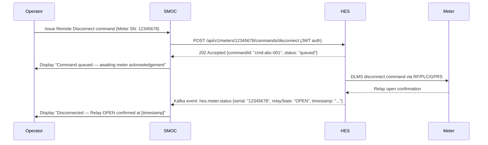

# SMOC Energy Management System — Product & Business Requirements Document

**Document Title:** Smart Metering Operations Centre (SMOC) — Energy Management System Requirements
**Tender Reference:** E2136DXLP
**Demo Date:** 21 April 2026
**Venue:** Megawatt Park, Sunninghill, Johannesburg
**Document Version:** 1.0
**Status:** Draft — For Development Team Review
**Author:** Systems Integration Team
**Date Prepared:** 01 April 2026
**Reviewers:** SMOC Lead, HES Lead, MDMS Lead, Demo Director

---

## Document Control

| Version | Date | Author | Changes |
|---------|------|--------|---------|
| 0.1 | 2026-03-28 | Systems Integration Team | Initial draft |
| 1.0 | 2026-04-01 | Systems Integration Team | Full requirements incorporating scorecard and integration proposal |

---

## Table of Contents

1. Executive Summary
2. System Overview and Architecture
3. Stakeholders and Personas
4. Scoring Framework and Demo Strategy
5. Functional Requirements — Category 1: Physical Infrastructure
6. Functional Requirements — Category 2: Control Room Operations
7. Functional Requirements — Category 3: AMI Energy Management Solution
8. Functional Requirements — Category 4: Application Development
9. DER Management Requirements and Simulation Scenarios
10. Integration Requirements — HES and MDMS
11. Non-Functional Requirements
12. Demo Scenario Scripts (REQ-21 through REQ-25)
13. GIS Visualization Requirements
14. Acceptance Criteria Summary and Scoring
15. Open Questions and Assumptions
16. Glossary

---

## 1. Executive Summary

### 1.1 Purpose

This document defines the complete product and business requirements for the Smart Metering Operations Centre (SMOC) Energy Management System to be demonstrated at Megawatt Park on 21 April 2026 as part of Eskom Tender E2136DXLP Stage 3 Technical Evaluation.

The SMOC is the operational nerve centre of Eskom's Advanced Metering Infrastructure (AMI) programme. It aggregates real-time and near-real-time data from upstream AMI systems — the Head End System (HES) and Meter Data Management System (MDMS) — and presents it through an integrated operational dashboard encompassing GIS visualization, DER (Distributed Energy Resource) management, energy analytics, network fault management, and physical control room audiovisual and environmental automation.

### 1.2 Tender Context

Eskom Tender E2136DXLP is a Stage 3 technical demonstration evaluation. The SMOC module carries a total evaluation weight of 133 points across 27 demonstration items. The scoring model awards:

- 100% of the item weight for a fully demonstrated capability
- 50% of the item weight for a partial demonstration
- 0% for a capability not demonstrated

The minimum acceptable score is 85% (113 points). The target score is 90% (120 points). With 26 Critical items weighted at 5 points each and one Important item weighted at 3 points, every missed Critical item costs 5 points — equivalent to missing the 85% threshold by demonstrating only 22 of 27 items. The development team must treat all 27 items as mandatory unless the Demo Director explicitly authorises a skip.

### 1.3 Scope

This document covers:

- All 27 SMOC evaluation items mapped to structured functional requirements
- Integration contracts with HES and MDMS
- Physical infrastructure and control room AV requirements
- DER simulation scenario scripts for four structured scenarios (solar overvoltage, EV fast charging, peaking microgrid, network fault/FLISR)
- Non-functional requirements applicable to the demo environment
- GIS visualization requirements

Out of scope for this document: HES-internal functionality, MDMS-internal processing, billing system integration, and WFM (Workforce Management) — these are addressed in their respective specification documents.

---

## 2. System Overview and Architecture

### 2.1 SMOC Role in the AMI Ecosystem

SMOC sits at the northbound apex of the AMI architecture. It is a read-aggregate-visualize-command layer that does not own meter data or communication — it consumes processed data from HES and MDMS and surfaces it to operational staff through purpose-built dashboards, GIS maps, alarm consoles, and simulation engines.

```
┌─────────────────────────────────────────────────────────────────────┐
│                              SMOC                                   │
│   GIS · DER Simulation · Alarm Console · Energy Analytics          │
│   Control Room A/V · Reporting · App Builder · Command Relay       │
└──────────┬────────────────────────────────────┬────────────────────┘
           │  Northbound APIs / Kafka Streams   │
  ┌────────▼────────┐                  ┌────────▼────────┐
  │      HES        │                  │      MDMS       │
  │  Meter Comms    │◄────────────────►│  Data Process   │
  │  Command Exec   │  Internal Sync   │  Analytics      │
  └────────┬────────┘                  └────────┬────────┘
           │                                    │
       Meters / DCUs                    Billing / CIS / GIS
```

### 2.2 Component Map

| SMOC Component | Purpose | Primary Data Source |
|----------------|---------|---------------------|
| LV Network Dashboard | Real-time operational view of LV feeders, transformer loading, voltage profiles | HES (Kafka + REST) |
| GIS Map Module | Geographic visualization of meters, feeders, outages, alarms, DER assets | HES geo-coordinates, MDMS outage analytics |
| HES Mirror Panel | Surfaced HES functionality for operators: provisioning, RC/DC, FOTA, network health | HES REST APIs |
| MDMS Mirror Panel | Surfaced MDMS functionality: VEE data, billing determinants, prepaid, reports | MDMS REST APIs |
| Outage Intelligence Engine | Correlates HES events and MDMS outage analytics to pinpoint faults on GIS | HES Kafka events, MDMS /analytics/outages |
| Energy Monitoring Module | Energy flow, balance calculations, branch-level and transformer-level consumption | MDMS interval data, HES readings |
| Energy Saving Analytics | Consumption benchmarking by company, department, branch, customer class | MDMS daily/billing data |
| Alert Management Console | Virtual object groups, alarm rule engine, multi-channel notification (SMS/email/app) | HES alarms Kafka topic, MDMS VEE exceptions |
| Data Monitoring Panel | Meter data accuracy, collection status per instrument across HES-MDMS-CC&B chain | HES /network/health, MDMS /analytics/noncommunicating |
| System Management | Meter and LV device supplier/product registry, field performance tracking | Internal SMOC database + HES inventory |
| Audit & Reporting | Energy intensive reads, meter reading inquiry, daily/periodic usage | MDMS /reports, /readings/daily |
| DER Management | PV, BESS, EV charging, microgrid monitoring, simulation and control | HES sensor data, DER APIs, simulation engine |
| Power Distribution Panel | Distribution room monitoring, environmental sensors (smoke, water) | HES DCU sensor feeds |
| Control Room A/V Controller | Video wall control, console screen routing, HVAC, blinds, Teams integration | AV middleware (Crestron/AMX or equivalent) |
| App Builder | Custom display, rule, algorithm, and app creation | SMOC platform SDK |

### 2.3 Physical Deployment — Demo Environment

For the 21 April 2026 demonstration, SMOC will be deployed on tenderer-owned infrastructure brought to Megawatt Park. The environment must be self-contained and operational without dependency on Eskom's internal network beyond the agreed demo connectivity arrangement.

Integration with HES and MDMS will operate over a private network segment or VPN established between SMOC, HES, and MDMS demo servers. API credentials and Kafka broker access must be established by 14 April 2026 (one week prior) per the integration timeline agreed in the SMOC Integration Proposal.

---

## 3. Stakeholders and Personas

| Stakeholder | Role | Interest in SMOC |
|-------------|------|------------------|
| Eskom Evaluation Panel | Technical evaluators scoring the demo | Verify all 27 demo points are demonstrated against scoring criteria |
| SMOC Control Room Operator | Primary end user — daily operations | LV network visibility, alarm management, command execution |
| Network Operations Manager | Supervisory — LV network health | Outage intelligence, DER status, KPI dashboards |
| AMI Programme Manager | Strategic oversight | Data accuracy, system integration health, reporting |
| Field Technician (via WFM) | Receives work orders from SMOC | Fault location coordinates, outage data, dispatch triggers |
| Customer Service (via CIS) | Uses SMOC data for customer queries | Prepaid balance, outage status, consumption data |
| DER Asset Manager | Manages rooftop PV, BESS, EV fleets | DER dashboard, curtailment commands, revenue tracking |
| IT Security Officer | Governs platform access | Role-based access, audit trails, data encryption |

---

## 4. Scoring Framework and Demo Strategy

### 4.1 Score Distribution

| Category | Items | Weight Each | Total Weight |
|----------|-------|-------------|--------------|
| Category 1: Physical Infrastructure | 2 | 5 | 10 |
| Category 2: Control Room Operations | 1 | 5 | 5 |
| Category 3: AMI Energy Management (Critical) | 23 | 5 | 115 |
| Category 3: AMI Energy Management (Important) | 1 | 3 | 3 |
| Category 4: Application Development | 1 | 5 | 5 |
| **Total** | **28 items (27 distinct REQs)** | — | **133** |

Note: REQ-4 covers multiple sub-items but scores as a single evaluation point (SMOC-4).

### 4.2 Threshold Analysis

| Target | Points Required | Items Required (full score) | Buffer |
|--------|----------------|----------------------------|--------|
| 85% | 113 pts | 23 Critical items (115 pts) | Can miss any 4 Critical items |
| 90% | 120 pts | 24 Critical + REQ-26 Important (123 pts) | Can miss any 3 Critical items |
| 100% | 133 pts | All 27 items | — |

### 4.3 Recommended Demo Sequence

Given 160 minutes allocated for SMOC evaluation (assuming sequential evaluation) at approximately 6.5 minutes per item:

| Block | Time | Items | Priority |
|-------|------|-------|----------|
| Block 1: Infrastructure Setup (static display) | 0–15 min | REQ-1, REQ-2 | Must |
| Block 2: Control Room AV Demo | 15–30 min | REQ-3 | Must |
| Block 3: Core AMI Dashboards | 30–75 min | REQ-4 through REQ-7 | Must |
| Block 4: Energy Management | 75–110 min | REQ-8 through REQ-14 | Must |
| Block 5: DER Management | 110–130 min | REQ-15 through REQ-20 | Attempt all |
| Block 6: DER Simulations | 130–155 min | REQ-21 through REQ-25 | Must |
| Block 7: GIS Drill-Down + App Builder | 155–160 min | REQ-26, REQ-27 | Must |

### 4.4 Skip Strategy (if time constrained)

If time pressure forces prioritization, the following items may be deferred without dropping below 85%:

- SMOC-15 (REQ-15): PV Management Dashboard — skip saves 6.5 min, costs 5 pts
- SMOC-16 (REQ-16): BESS Storage Management — skip saves 6.5 min, costs 5 pts
- SMOC-17 (REQ-17): EV Charging Management — skip saves 6.5 min, costs 5 pts

Skipping all three: 118/133 = 88.7% — still above 85% threshold. However, these three items contribute directly to DER simulation scenarios (REQ-21 to REQ-23), so skipping the management dashboards while running the simulations is contradictory. The recommended approach is to demonstrate SMOC-15, 16, and 17 as quick 3-minute walkthroughs during the DER simulation setup rather than as standalone items.

---

## 5. Functional Requirements — Category 1: Physical Infrastructure

### SMOC-FUNC-001 — SMOC Facility Layout Rendering

**Requirement ID:** SMOC-FUNC-001
**Source Requirement:** REQ-1 (SMOC-1)
**Priority:** Critical
**Evaluation Weight:** 5
**Tender Item:** SMOC-1

**Description:**
The tenderer must present a rendered visualization of the proposed SMOC facility layout including room design, operator console arrangement, video wall placement, equipment rack positioning, cable management, and all cosmetic and aesthetic elements. This rendering demonstrates the tenderer's capability to design and deliver a functional, ergonomic, and professionally appointed SMOC control room for Eskom's AMI programme.

**Functional Requirements:**

| ID | Requirement |
|----|-------------|
| SMOC-FUNC-001-FR-01 | A high-fidelity 2D floor plan or 3D rendered image of the SMOC control room must be produced showing all major elements to scale |
| SMOC-FUNC-001-FR-02 | The rendering must show operator console positions, seating arrangement, sightlines to video wall, and accessibility pathways |
| SMOC-FUNC-001-FR-03 | Aesthetic elements must be depicted: lighting (ambient and task), wall treatments, raised flooring if applicable, ceiling features, colour scheme consistent with utility control room standards |
| SMOC-FUNC-001-FR-04 | The layout must show separation of zones: primary operator zone, supervisory zone, visitor/evaluation zone, equipment zone |
| SMOC-FUNC-001-FR-05 | Video wall dimensions, aspect ratio, and viewing distance from all operator positions must be indicated |
| SMOC-FUNC-001-FR-06 | Cable management strategy must be visible (raised floor routing, overhead trunking, or equivalent) |
| SMOC-FUNC-001-FR-07 | The rendering must be presented as a printed or projected visual during the demo — minimum A1 size print or 1920x1080 rendered image on presentation screen |

**Acceptance Criteria:**

| Score | Condition |
|-------|-----------|
| 100% (5 pts) | Full 3D rendered or high-fidelity 2D floor plan presented showing all FR items above with clear labelling, professional quality suitable for executive presentation |
| 50% (2.5 pts) | Basic schematic floor plan or rough layout sketch with major elements identifiable but lacking aesthetic detail or scale accuracy |
| 0% | No rendering presented or rendering is a generic stock image not specific to the proposed SMOC design |

**Demo Scenario:**
Present the SMOC layout rendering on the video wall or dedicated presentation screen at the start of the demo. The presenter should walk the evaluation panel through each zone, explain the ergonomic design rationale, and highlight Eskom-specific considerations (e.g., number of operator positions sized for Eskom's planned operational headcount, supervisor station placement).

---

### SMOC-FUNC-002 — SMOC Physical Hardware Rendering

**Requirement ID:** SMOC-FUNC-002
**Source Requirement:** REQ-2 (SMOC-2)
**Priority:** Critical
**Evaluation Weight:** 5
**Tender Item:** SMOC-2

**Description:**
The tenderer must present a rendered visualization of all physical hardware proposed for installation in the SMOC. This includes operator workstations, video wall display units, servers and computing equipment, network infrastructure, AV control systems, UPS and power distribution, environmental control units, and all peripheral devices.

**Functional Requirements:**

| ID | Requirement |
|----|-------------|
| SMOC-FUNC-002-FR-01 | Hardware list rendered or tabulated for: operator workstations (make, model, screen configuration), video wall (display technology, tile count, controller), server/compute rack (servers, networking gear, storage), AV controller (matrix switcher, control processor), and UPS |
| SMOC-FUNC-002-FR-02 | Render must show rack elevation diagrams with equipment positioned and labelled |
| SMOC-FUNC-002-FR-03 | Video wall hardware must show LED or LCD tile specification, bezel dimensions, brightness rating, and resolution per tile and aggregate |
| SMOC-FUNC-002-FR-04 | Operator workstation hardware must include multi-monitor configuration, KVM arrangement, and ergonomic peripherals |
| SMOC-FUNC-002-FR-05 | Network topology diagram showing connectivity between all hardware components, including redundant paths if applicable |
| SMOC-FUNC-002-FR-06 | Hardware rendering must indicate environmental hardware: HVAC control interface, motorized blind actuators, environmental sensors |

**Acceptance Criteria:**

| Score | Condition |
|-------|-----------|
| 100% (5 pts) | Comprehensive hardware specification with rack diagrams, product datasheets or renders for all major components, network topology shown, presented clearly to the evaluation panel |
| 50% (2.5 pts) | Hardware list provided with basic descriptions but lacking visual renders, rack diagrams, or specific product identification |
| 0% | No hardware specification presented or hardware described only verbally without supporting documentation |

**Demo Scenario:**
Present hardware renders as a slide deck or printed material alongside the facility layout. Correlate hardware positions to the facility floor plan from SMOC-FUNC-001. If the actual demo hardware is on-site at Megawatt Park, physically point to components as they are described.

---

## 6. Functional Requirements — Category 2: Control Room Operations

### SMOC-FUNC-003 — Room AV and Environmental Control System

**Requirement ID:** SMOC-FUNC-003
**Source Requirement:** REQ-3 (SMOC-3)
**Priority:** Critical
**Evaluation Weight:** 5
**Tender Item:** SMOC-3

**Description:**
The SMOC control room must be equipped with an integrated audiovisual and environmental control system that allows operators to manage video wall content, peripheral device control (HVAC, blinds), user access, and collaboration (Microsoft Teams). The system must be demonstrated live.

**Functional Requirements:**

| ID | Requirement |
|----|-------------|
| SMOC-FUNC-003-FR-01 | **Screen routing:** Any application window displayed on any operator console must be routable to the video wall via software control (drag-and-drop or AV control panel touch interface) without physical cable intervention |
| SMOC-FUNC-003-FR-02 | **Video wall segmentation:** The video wall must support dynamic segmentation — the operator must demonstrate switching from a multi-window layout (minimum 4 independent windows) to a 2-window layout and to a single full-wall display, in real time |
| SMOC-FUNC-003-FR-03 | **Readability:** Each video wall segment must maintain clear text readability at the operator's working distance (minimum 3 metres); font size and contrast must meet ISO 9241-303 ergonomic display standards |
| SMOC-FUNC-003-FR-04 | **HVAC control:** From the AV control panel or SMOC UI, the operator must be able to adjust room temperature setpoint and demonstrate a confirmed setpoint change registered by the HVAC system |
| SMOC-FUNC-003-FR-05 | **Blind control:** From the AV control panel or SMOC UI, motorized window blinds must be raised and lowered on command |
| SMOC-FUNC-003-FR-06 | **Multi-user security:** The AV control system must support at minimum three distinct user roles with differentiated access: (a) Operator — can route own console to video wall; (b) Supervisor — can override any console routing and lock segments; (c) Administrator — full system control including configuration |
| SMOC-FUNC-003-FR-07 | **Microsoft Teams integration:** The control room must demonstrate Teams functionality from within the SMOC environment including: initiating a video call to an external participant, sharing a SMOC application window in the Teams meeting, adjusting microphone and camera from the room control panel |
| SMOC-FUNC-003-FR-08 | All AV and environmental control functions must be operable from a single unified control interface (hardware touch panel or software UI) without requiring access to separate vendor management portals |

**Acceptance Criteria:**

| Score | Condition |
|-------|-----------|
| 100% (5 pts) | All five capabilities demonstrated live and successfully: screen routing, video wall segmentation (multi to 2 to 1), peripheral control (HVAC + blinds), multi-user security demonstration, and Teams call/share |
| 50% (2.5 pts) | At least three of the five capabilities demonstrated successfully; remaining capabilities shown partially or described with supporting evidence |
| 0% | Fewer than three capabilities demonstrated, or AV system inoperative during demo |

**Demo Scenario:**
1. Operator logs into console as role "Operator" — attempt to access supervisor functions — system denies access.
2. Operator drags SMOC LV Network dashboard to video wall segment 1.
3. Supervisor logs in — reconfigures video wall to 2-window layout, places GIS map on segment 2.
4. Administrator reconfigures to full-wall single display showing the real-time DER dashboard.
5. Operator adjusts HVAC setpoint from +2 degrees — system confirms new setpoint.
6. Operator raises window blind via control panel.
7. Administrator initiates Teams call — screen-shares the SMOC dashboard to remote evaluator.

**Technical Notes:**
AV middleware must be pre-configured with three named demo user accounts. Teams must be authenticated against a valid Microsoft 365 tenant (tenderer's own tenant is acceptable). The Teams room device (camera, speaker bar) must be physically installed and tested at Megawatt Park during setup day (20 April 2026).

---

## 7. Functional Requirements — Category 3: AMI Energy Management Solution

### SMOC-FUNC-004 — Real-Time LV Network Management Dashboard

**Requirement ID:** SMOC-FUNC-004
**Source Requirement:** REQ-4 (SMOC-4)
**Priority:** Critical
**Evaluation Weight:** 5
**Tender Item:** SMOC-4

**Description:**
The SMOC must present a real-time operational dashboard focused on LV network management with deep AMI integration. This is the primary operational view for control room operators and must surface automated meter reading results, remote connect/disconnect capability, sensor inputs from the LV network, configurable alarm and theft detection rules, outage lifecycle management, customer conservation data, non-technical loss indicators, and DER integration status — all in a single coherent operational interface.

**Functional Requirements:**

| ID | Requirement |
|----|-------------|
| SMOC-FUNC-004-FR-01 | Dashboard must display a real-time summary of the LV network: active meters count, offline meters count, meters in alarm state, average network voltage, and aggregate consumption for the current interval |
| SMOC-FUNC-004-FR-02 | Automated meter reading results must be visible per meter with last read timestamp, consumption value, and data quality indicator (VEE status from MDMS) |
| SMOC-FUNC-004-FR-03 | Remote connect/disconnect must be executable from the dashboard: operator selects a meter, issues RC or DC command, command status (pending/acknowledged/executed/failed) is displayed in real time |
| SMOC-FUNC-004-FR-04 | Sensor inputs from the LV network (transformer temperature, feeder current via sensor-equipped DCUs) must be displayed alongside meter data for the same network segment |
| SMOC-FUNC-004-FR-05 | Configurable alarm rules must be demonstrable: operator creates a rule (e.g., "alert when voltage at any meter exceeds 253V for more than 5 minutes") and the rule is saved and active |
| SMOC-FUNC-004-FR-06 | Tamper and theft detection events from HES (cover open, magnetic interference, reverse current, energy imbalance) must be displayed as categorized alerts with meter ID, timestamp, and severity |
| SMOC-FUNC-004-FR-07 | Outage events must be displayed with lifecycle stages: detected, under investigation, crew dispatched, restored. Operator must be able to update outage status and add notes |
| SMOC-FUNC-004-FR-08 | Customer energy conservation view: display high-consumption customers (above configurable threshold) and customers who have reduced consumption by configurable percentage versus prior period |
| SMOC-FUNC-004-FR-09 | Non-technical loss (NTL) indicator: display metering points where calculated energy balance shows unexplained loss exceeding configurable threshold (e.g., >5% loss on a feeder segment) |
| SMOC-FUNC-004-FR-10 | DER integration status: connected rooftop PV installations and EV charging points must appear on the dashboard with their current operational status (generating/idle/exporting/charging) |

**Acceptance Criteria:**

| Score | Condition |
|-------|-----------|
| 100% (5 pts) | Dashboard visible with live data showing all FR items; RC/DC command executed and confirmed; at least one alarm rule created live; outage lifecycle demonstrated; NTL indicator shown; DER status visible |
| 50% (2.5 pts) | Dashboard visible with at least 6 of 10 FR items populated; some data may be static/pre-loaded; command execution demonstrated but not confirmed live |
| 0% | Dashboard not functional, data not visible, or fewer than 4 FR items demonstrated |

**Data Requirements for Demo:**
The demo dataset must include at minimum: 50 active meters across 3 LV feeders, 2 meters in tamper/theft alarm state, 1 active outage scenario pre-loaded, 5 meters with DER (PV) association, 1 feeder with NTL indicator active. Data should be pre-loaded in HES and MDMS before demo day.

---

### SMOC-FUNC-005 — HES Functionality Display

**Requirement ID:** SMOC-FUNC-005
**Source Requirement:** REQ-5 (SMOC-5)
**Priority:** Critical
**Evaluation Weight:** 5
**Tender Item:** SMOC-5

**Description:**
SMOC must surface core HES functionality to operators through the SMOC interface, acting as a unified operational front-end. Operators should be able to perform the following HES-resident operations from within SMOC without switching to the HES application directly.

**Functional Requirements:**

| ID | Requirement |
|----|-------------|
| SMOC-FUNC-005-FR-01 | **Meter Provisioning:** Display the meter provisioning workflow — operator can search for an unprovisioned meter serial, view its discovered parameters (meter type, firmware, communication tech), and confirm provisioning into the active estate |
| SMOC-FUNC-005-FR-02 | **Remote Connect/Disconnect:** RC/DC commands must be issuable from SMOC through HES Command API; response status and relay state confirmation must be displayed within 30 seconds of command issuance for a communicating meter |
| SMOC-FUNC-005-FR-03 | **Firmware OTA (FOTA):** Operator must be able to initiate a firmware upgrade job from SMOC — select target meter(s), select target firmware version, submit job; SMOC must display job progress (queued/in-progress/complete/failed) by polling HES |
| SMOC-FUNC-005-FR-04 | **On-Demand Reads:** Operator selects a meter and triggers an on-demand read from SMOC; the result (interval registers: kWh import, kWh export, demand, voltage, current) must be displayed within 60 seconds |
| SMOC-FUNC-005-FR-05 | **Alarms and Events:** SMOC must display the live HES alarm feed — events from Kafka topic `hes.meter.alarms` and `hes.meter.events` — with meter ID, event type, timestamp, and severity classification; operator must be able to acknowledge alarms from SMOC |
| SMOC-FUNC-005-FR-06 | **Communication Network Health:** SMOC must display the real-time network health KPIs sourced from HES `/api/v1/network/health`: total registered meters, currently communicating meters, offline meters, and communication success rate percentage, updated at configurable interval (default 5 minutes) |

**Sequence Diagram — RC/DC Command Flow:**



**Acceptance Criteria:**

| Score | Condition |
|-------|-----------|
| 100% (5 pts) | All six HES functions demonstrated from SMOC: provisioning walkthrough, RC/DC with relay confirmation, FOTA job submitted and progress shown, on-demand read result displayed, live alarm feed visible with acknowledgement, and network health KPIs current |
| 50% (2.5 pts) | At least four of six functions demonstrated; RC/DC or on-demand read may have been shown via HES UI rather than through SMOC |
| 0% | SMOC does not surface HES functionality or fewer than three functions demonstrated |

**Technical Notes:**
SMOC must hold a valid JWT token for the HES Command API. Token refresh must be handled transparently (Cognito token refresh). For demo resilience, SMOC should implement a fallback mode where HES commands are simulated with pre-recorded response sequences if the physical meter does not respond — this fallback must be disclosed to evaluators before use.

---

### SMOC-FUNC-006 — MDMS Functionality Display

**Requirement ID:** SMOC-FUNC-006
**Source Requirement:** REQ-6 (SMOC-6)
**Priority:** Critical
**Evaluation Weight:** 5
**Tender Item:** SMOC-6

**Description:**
SMOC must surface core MDMS functionality through its interface, presenting MDMS as the authoritative data processing and analytics layer. Operators must be able to access VEE-processed data, billing determinants, consumer-enriched meter data, load profiles, tamper analytics, and secure data access — all without leaving the SMOC environment.

**Functional Requirements:**

| ID | Requirement |
|----|-------------|
| SMOC-FUNC-006-FR-01 | **VEE Data Display:** SMOC must display VEE-processed interval data for selected meters sourced from MDMS `/api/v1/readings/interval/{serial}` — showing raw vs. VEE-processed values, VEE status (validated/estimated/edited), and VEE exception flags |
| SMOC-FUNC-006-FR-02 | **Billing Determinants:** SMOC must display billing determinants from MDMS for a selected consumer account: TOU energy by period (peak/standard/off-peak), maximum demand, reactive energy, and critical peak pricing charges |
| SMOC-FUNC-006-FR-03 | **Enriched Meter Data:** Meter data displayed in SMOC must be enriched with consumer, premise, transformer, and phase attributes sourced from MDMS (which holds the CIS/CC&B and GIS enrichment) — operator selects a meter and sees: customer name, account number, service address, tariff class, connected transformer, and phase assignment |
| SMOC-FUNC-006-FR-04 | **Load Profiles:** SMOC must display load profile data (15-minute or 30-minute interval consumption chart) for at least one customer class, sourced from MDMS, with date range selection capability |
| SMOC-FUNC-006-FR-05 | **Tamper and Theft Analytics:** SMOC must display MDMS-side tamper analytics — meters with unexplained consumption anomalies, meters with billing data gaps, energy balance violations — distinct from raw HES tamper events |
| SMOC-FUNC-006-FR-06 | **Single Source of Truth API View:** SMOC must demonstrate that it accesses MDMS data through secure authenticated APIs (JWT/Cognito) — show API call log or integration health status confirming authenticated data access |

**Acceptance Criteria:**

| Score | Condition |
|-------|-----------|
| 100% (5 pts) | All six FR items demonstrated: VEE data with status flags, billing determinants with TOU breakdown, enriched meter record (customer + transformer + phase), load profile chart, tamper analytics panel, and API authentication evidence |
| 50% (2.5 pts) | At least four FR items demonstrated; data may be pre-loaded; VEE status or billing determinants may be shown in simplified form |
| 0% | SMOC does not surface MDMS data or fewer than three FR items demonstrated |

---

### SMOC-FUNC-007 — Outage Intelligence

**Requirement ID:** SMOC-FUNC-007
**Source Requirement:** REQ-7 (SMOC-7)
**Priority:** Critical
**Evaluation Weight:** 5
**Tender Item:** SMOC-7

**Description:**
SMOC must provide an integrated outage intelligence capability that correlates meter events and alarms from HES with outage analytics from MDMS to pinpoint faults geographically on the GIS map. Additionally, SMOC must provide LV network visibility (voltage profiles, transformer loading), prepaid metering functionality, and customizable dashboards and reports.

**Functional Requirements:**

| ID | Requirement |
|----|-------------|
| SMOC-FUNC-007-FR-01 | **Event Correlation Engine:** SMOC must implement logic that correlates multiple meter "power outage" events arriving from HES within a configurable time window (e.g., 60 seconds) to identify the likely upstream fault point (upstream transformer or feeder segment) |
| SMOC-FUNC-007-FR-02 | **GIS Fault Pinpointing:** Correlated outage events must be displayed as a geographic incident on the GIS map, showing: affected meters as red markers, suspected fault location as a distinct incident marker, affected area polygon if multiple consecutive meters are dark |
| SMOC-FUNC-007-FR-03 | **Voltage Profile Visualization:** SMOC must display voltage readings from meters along an LV feeder as a line chart (voltage vs. distance from transformer or voltage vs. meter sequence) sourced from HES latest readings, updated at configurable interval |
| SMOC-FUNC-007-FR-04 | **Transformer Loading:** SMOC must display current transformer loading as a percentage of rated capacity, with colour-coded status: green (<80%), amber (80–100%), red (>100%), sourced from transformer sensors or aggregated meter demand readings |
| SMOC-FUNC-007-FR-05 | **Prepaid Metering Panel:** SMOC must display prepaid meter status for selected accounts: current credit balance (sourced from MDMS `/api/v1/prepaid/{serial}/balance`), ACD status, last token loaded date, and ability to initiate token issuance command via MDMS Command API |
| SMOC-FUNC-007-FR-06 | **Customizable Dashboards:** SMOC must provide at least three pre-configured dashboard templates (LV Network Operations, DER Overview, Outage Management) and allow operators to create and save custom dashboard layouts by selecting, resizing, and repositioning widgets |
| SMOC-FUNC-007-FR-07 | **Report Builder:** SMOC must allow on-demand generation of reports with configurable parameters: report type (consumption, outage, alarm, VEE exceptions), date range, meter filter (by feeder, transformer, customer class), and output format (PDF, CSV, Excel) |

**Acceptance Criteria:**

| Score | Condition |
|-------|-----------|
| 100% (5 pts) | All FR items demonstrated: event correlation logic explained with live or pre-loaded outage data, GIS fault pinpointing shown, voltage profile chart displayed, transformer loading visible, prepaid panel with live balance, at least one custom dashboard created live, and report generated and exported |
| 50% (2.5 pts) | At least five of seven FR items demonstrated; GIS pinpointing or correlation logic may be shown with pre-loaded scenario rather than live events |
| 0% | Fewer than four FR items demonstrated |

---

### SMOC-FUNC-008 — Energy Monitoring

**Requirement ID:** SMOC-FUNC-008
**Source Requirement:** REQ-8 (SMOC-8)
**Priority:** Critical
**Evaluation Weight:** 5
**Tender Item:** SMOC-8

**Description:**
SMOC must provide comprehensive energy monitoring capabilities covering energy flow visualization, balance calculations, branch-level consumption tracking, real-time and historical meter data, equipment parameter monitoring, and calibration/sub-item monitoring.

**Functional Requirements:**

| ID | Requirement |
|----|-------------|
| SMOC-FUNC-008-FR-01 | **Energy Flow Display:** Animated single-line diagram or Sankey chart showing energy flow from source (grid injection point) through feeder, transformer, and down to end consumer meters — with live kWh values at each node |
| SMOC-FUNC-008-FR-02 | **Energy Balance:** Calculate and display the energy balance for each distribution segment: injected energy vs. sum of consumer energy — display loss percentage and flag segments exceeding configurable NTL threshold |
| SMOC-FUNC-008-FR-03 | **Branch Consumption:** Display per-branch (per-feeder) total consumption for configurable time periods: current interval, daily, weekly, monthly — with trend arrows indicating increase/decrease versus prior period |
| SMOC-FUNC-008-FR-04 | **Real-Time Meter Data:** Display live meter reads for selected meters: kWh import, kWh export, kVArh, demand (kW/kVA), voltage (per phase), current (per phase), power factor — refreshed via on-demand read or Kafka stream |
| SMOC-FUNC-008-FR-05 | **Hourly Data View:** Display hourly consumption totals in a bar chart for a selected meter and date range (up to 31 days) sourced from MDMS interval data |
| SMOC-FUNC-008-FR-06 | **Equipment Parameter Reporting:** Display equipment parameters for selected LV devices (transformers, DCUs): nameplate rating, installation date, firmware version, communication status, last event timestamp |
| SMOC-FUNC-008-FR-07 | **Calibration / Sub-Item Monitor:** Display meter accuracy and calibration flags where available — highlight meters with drift indicators or calibration expiry alerts (if supported by meter firmware) |

**Acceptance Criteria:**

| Score | Condition |
|-------|-----------|
| 100% (5 pts) | All seven FR items demonstrated with live or clearly pre-loaded data; energy balance calculation shown with loss percentage; real-time meter data refreshed during demo |
| 50% (2.5 pts) | At least five FR items demonstrated; energy flow diagram may be static; hourly data from MDMS may be pre-loaded |
| 0% | Fewer than four FR items demonstrated or energy monitoring module not functional |

---

### SMOC-FUNC-009 — Energy Saving Analysis

**Requirement ID:** SMOC-FUNC-009
**Source Requirement:** REQ-9 (SMOC-9)
**Priority:** Critical
**Evaluation Weight:** 5
**Tender Item:** SMOC-9

**Description:**
SMOC must provide energy saving analysis tools that allow consumption benchmarking and comparison across organizational hierarchy levels: utility-wide, department (distribution region), customer class or branch, and individual customer. The analysis must support conservation target setting and performance tracking.

**Functional Requirements:**

| ID | Requirement |
|----|-------------|
| SMOC-FUNC-009-FR-01 | **Hierarchical Consumption View:** Display total energy consumption aggregated at four levels: Company/Utility (total grid consumption), Department/Region (distribution region), Branch/Feeder (LV feeder level), and Individual Customer — navigable by drill-down |
| SMOC-FUNC-009-FR-02 | **Period Comparison:** For each level, display current period consumption versus prior period (week-on-week, month-on-month, year-on-year) with percentage change and trend direction indicator |
| SMOC-FUNC-009-FR-03 | **Consumption Benchmarking:** Display average consumption per customer within a tariff class or geographic cluster — flag customers consuming significantly above the average (configurable threshold, e.g., >150% of cluster average) |
| SMOC-FUNC-009-FR-04 | **Conservation Target Dashboard:** Allow setting of a consumption reduction target (as percentage) per feeder or department — display progress toward target as a gauge or progress bar |
| SMOC-FUNC-009-FR-05 | **Top Consumers List:** Display a sortable, filterable table of top energy consumers by period (day/week/month) with customer name, account number, tariff class, and consumption value |
| SMOC-FUNC-009-FR-06 | **Export:** Allow export of the energy saving analysis report in PDF or CSV format with selected time period and organizational scope |

**Acceptance Criteria:**

| Score | Condition |
|-------|-----------|
| 100% (5 pts) | All six FR items demonstrated; hierarchical drill-down navigated live (company → department → branch → customer); period comparison shown; top consumers list displayed; at least one export performed |
| 50% (2.5 pts) | At least four FR items demonstrated; comparison or drill-down may use static pre-loaded data |
| 0% | Energy saving analysis module not functional or fewer than three FR items demonstrated |

---

### SMOC-FUNC-010 — Alert Management

**Requirement ID:** SMOC-FUNC-010
**Source Requirement:** REQ-10 (SMOC-10)
**Priority:** Critical
**Evaluation Weight:** 5
**Tender Item:** SMOC-10

**Description:**
SMOC must provide a comprehensive alert management system with virtual object group management, configurable alarm rule creation, and multi-channel notification delivery by alarm priority.

**Functional Requirements:**

| ID | Requirement |
|----|-------------|
| SMOC-FUNC-010-FR-01 | **Virtual Object Groups:** Operator can create named groups of meters or network assets (e.g., "Soweto Zone 3 Feeders", "Prepaid Residential Cluster A") — alarms and reports can be scoped to these groups |
| SMOC-FUNC-010-FR-02 | **Alarm Rule Creation:** Operator can create a new alarm rule specifying: trigger condition (e.g., voltage < 207V, consumption delta > X kWh, tamper event received), target object or group, severity classification (Critical/High/Medium/Low), and escalation path |
| SMOC-FUNC-010-FR-03 | **Alarm Subscription:** Operators and supervisors can subscribe to alarm categories — subscriptions specify notification channels: SMS, email, and/or in-app notification |
| SMOC-FUNC-010-FR-04 | **Priority-Based Notification:** Critical alarms must trigger immediate notification on all subscribed channels; High alarms within 5 minutes; Medium within 30 minutes — notification timing must be configurable |
| SMOC-FUNC-010-FR-05 | **Alarm Console:** Live alarm console displays all active alarms sorted by severity and time, with per-alarm detail: asset ID, alarm type, timestamp, rule name, current state (new/acknowledged/resolved) |
| SMOC-FUNC-010-FR-06 | **Alarm Acknowledgement and Resolution:** Operator can acknowledge an alarm (with optional comment) and mark it as resolved — audit trail of acknowledgement actions maintained |
| SMOC-FUNC-010-FR-07 | **Alarm Statistics:** Dashboard widget showing alarm volume by category and severity for configurable period — trend chart showing alarm rate over time |

**Acceptance Criteria:**

| Score | Condition |
|-------|-----------|
| 100% (5 pts) | All FR items demonstrated: virtual object group created, new alarm rule created live, subscription configured, live alarm console shown with active alarms, at least one alarm acknowledged, and alarm statistics widget visible |
| 50% (2.5 pts) | At least five FR items demonstrated; notification delivery (SMS/email) may be shown via log or pre-triggered test rather than live during demo |
| 0% | Alert management module not functional or fewer than three FR items demonstrated |

---

### SMOC-FUNC-011 — Data Monitoring and Performance

**Requirement ID:** SMOC-FUNC-011
**Source Requirement:** REQ-11 (SMOC-11)
**Priority:** Critical
**Evaluation Weight:** 5
**Tender Item:** SMOC-11

**Description:**
SMOC must provide a data monitoring and system performance view that tracks metering data accuracy and completeness across the full AMI value chain: HES → MDMS → CC&B (CIS). Collection status must be visible per meter with instrument metadata.

**Functional Requirements:**

| ID | Requirement |
|----|-------------|
| SMOC-FUNC-011-FR-01 | **AMI Value Chain Data Quality:** Display a summary scorecard showing data completeness at each layer: HES collection rate (% of expected reads received), MDMS VEE pass rate (% of reads that passed validation), and CC&B/billing export success rate |
| SMOC-FUNC-011-FR-02 | **Per-Meter Collection Status Table:** Tabular view with one row per meter showing: instrument code (meter serial or ID), instrument name, last collection timestamp, online/offline status, VEE status, and billing export status |
| SMOC-FUNC-011-FR-03 | **Filter and Search:** Collection status table must support filtering by: online status, VEE status, feeder/transformer, last collection age (e.g., "meters not read in >24 hours"), and instrument code search |
| SMOC-FUNC-011-FR-04 | **Data Gap Alerting:** Meters that have not reported within the expected read cycle (configurable, default 24 hours) must be automatically flagged in the collection status view with gap duration |
| SMOC-FUNC-011-FR-05 | **System Performance KPIs:** Display HES communication performance: commands issued, commands successful, commands failed, average response time — sourced from HES network health API |

**Acceptance Criteria:**

| Score | Condition |
|-------|-----------|
| 100% (5 pts) | All FR items demonstrated: value chain scorecard visible, per-meter table with all columns populated, filter applied live, data gap flagging shown for at least one meter, system performance KPIs displayed |
| 50% (2.5 pts) | At least three FR items demonstrated; per-meter table visible with partial columns; filtering not demonstrated |
| 0% | Data monitoring module not functional |

---

### SMOC-FUNC-012 — System Management

**Requirement ID:** SMOC-FUNC-012
**Source Requirement:** REQ-12 (SMOC-12)
**Priority:** Critical
**Evaluation Weight:** 5
**Tender Item:** SMOC-12

**Description:**
SMOC must maintain a system management registry covering supplier and product information for all meters and LV devices in the field, and track instrument and supplier performance per equipment type.

**Functional Requirements:**

| ID | Requirement |
|----|-------------|
| SMOC-FUNC-012-FR-01 | **Meter Product Registry:** Display a catalogue of meter types in the field: manufacturer, model, firmware version, communication technology, meter class, date of entry into service |
| SMOC-FUNC-012-FR-02 | **LV Device Registry:** Similar registry for LV network devices: DCUs/concentrators, distribution transformers, sensors — with supplier, model, and field installation count |
| SMOC-FUNC-012-FR-03 | **Supplier Performance:** Per supplier, display aggregate field performance metrics: average communication success rate, FOTA success rate, alarm rate per 1000 meters, mean time between failures (MTBF) if data available |
| SMOC-FUNC-012-FR-04 | **Equipment Performance:** Per equipment model, display field performance: online rate, failure count, replacement rate, average service life |
| SMOC-FUNC-012-FR-05 | **Asset Search:** Operator can search for a specific meter serial or device ID and retrieve its full system management record: product classification, supplier, field status, associated alarms, maintenance history |

**Acceptance Criteria:**

| Score | Condition |
|-------|-----------|
| 100% (5 pts) | All FR items demonstrated: meter product registry shown with minimum 3 meter types, LV device registry shown, supplier performance metrics visible, equipment performance metrics visible, asset search executed live |
| 50% (2.5 pts) | At least three FR items demonstrated; performance metrics may be indicative/pre-loaded |
| 0% | System management module not functional |

---

### SMOC-FUNC-013 — Audit Statement Management

**Requirement ID:** SMOC-FUNC-013
**Source Requirement:** REQ-13 (SMOC-13)
**Priority:** Critical
**Evaluation Weight:** 5
**Tender Item:** SMOC-13

**Description:**
SMOC must provide audit statement management covering energy-intensive reading reports, centralized meter reading inquiry, and daily and periodic energy usage data — supporting regulatory compliance and audit requirements.

**Functional Requirements:**

| ID | Requirement |
|----|-------------|
| SMOC-FUNC-013-FR-01 | **Energy Intensive Reading Report:** Generate a report listing meters classified as energy-intensive consumers (above configurable threshold kWh/month), showing reading history, average consumption, and anomaly flags |
| SMOC-FUNC-013-FR-02 | **Centralized Meter Reading Inquiry:** Operator enters a meter serial or account number and retrieves the full reading history for a selected period — readings displayed in tabular format with timestamps, values, and VEE flags |
| SMOC-FUNC-013-FR-03 | **Daily Energy Usage Data:** Display daily consumption totals per meter for a configurable date range, sourced from MDMS `/api/v1/readings/daily/{serial}` |
| SMOC-FUNC-013-FR-04 | **Periodic Energy Usage Summary:** Aggregate daily data into weekly and monthly summaries per meter or meter group, displayed as a table and bar chart |
| SMOC-FUNC-013-FR-05 | **Audit Trail:** All operator actions within SMOC (command issued, alarm acknowledged, dashboard modified, report generated) must be logged with username, timestamp, and action detail — accessible via an audit log view with date range filter |

**Acceptance Criteria:**

| Score | Condition |
|-------|-----------|
| 100% (5 pts) | All FR items demonstrated: energy intensive report generated, meter reading inquiry executed for a specific meter, daily usage data displayed, periodic summary shown, audit trail accessed with operator actions visible |
| 50% (2.5 pts) | At least three FR items demonstrated; audit trail may show system events rather than operator actions |
| 0% | Audit management module not functional |

---

### SMOC-FUNC-014 — Electricity Consumption Reporting

**Requirement ID:** SMOC-FUNC-014
**Source Requirement:** REQ-14 (SMOC-14)
**Priority:** Critical
**Evaluation Weight:** 5
**Tender Item:** SMOC-14

**Description:**
SMOC must provide standardized electricity consumption reporting covering daily meter readings, monthly consumption totals, and purchasing/procurement data — supporting billing validation and revenue assurance functions.

**Functional Requirements:**

| ID | Requirement |
|----|-------------|
| SMOC-FUNC-014-FR-01 | **Daily Meter Reading Report:** Tabular report showing meter ID, date, opening register, closing register, and net consumption for each day in the selected period — exportable to CSV/Excel |
| SMOC-FUNC-014-FR-02 | **Monthly Consumption Report:** Summary report showing total consumption per meter for each month in the selected period — with month-on-month comparison and percentage variance |
| SMOC-FUNC-014-FR-03 | **Purchasing Report:** For prepaid meters, display token purchase history: date, token amount (kWh or currency), purchase channel, and cumulative credit loaded in the period |
| SMOC-FUNC-014-FR-04 | **Bulk Report Generation:** Operator can select multiple meters (by feeder, transformer, or customer group) and generate consumption reports for the entire selection as a single download |
| SMOC-FUNC-014-FR-05 | **Scheduled Report Delivery:** Operator can configure a report to be automatically generated and emailed on a schedule (daily, weekly, monthly) to specified recipients |

**Acceptance Criteria:**

| Score | Condition |
|-------|-----------|
| 100% (5 pts) | All FR items demonstrated: daily reading report generated and exported, monthly consumption report shown with variance, purchasing report shown for a prepaid meter, bulk report for multiple meters generated, scheduled delivery configured |
| 50% (2.5 pts) | At least three FR items demonstrated; reports visible on screen but export or scheduled delivery not demonstrated |
| 0% | Reporting module not functional |

---

### SMOC-FUNC-015 — PV System Management Dashboard

**Requirement ID:** SMOC-FUNC-015
**Source Requirement:** REQ-15 (SMOC-15)
**Priority:** Critical
**Evaluation Weight:** 5
**Tender Item:** SMOC-15
**Demo Strategy:** Demonstrate as part of DER simulation setup — can be abbreviated to 3 minutes if time is constrained

**Description:**
SMOC must provide a PV (photovoltaic) system management dashboard showing generation status, inverter health, generation achievement, and utilization metrics for all PV installations registered in the SMOC estate.

**Functional Requirements:**

| ID | Requirement |
|----|-------------|
| SMOC-FUNC-015-FR-01 | **PV Portfolio Dashboard:** Overview showing: total installed PV capacity (kWp), current aggregate generation (kW), total energy generated today (kWh), and number of inverters online vs. offline |
| SMOC-FUNC-015-FR-02 | **Per-Installation Detail:** For a selected PV installation: current power output (kW), daily generation (kWh), inverter status (online/offline/fault), inverter efficiency, DC input voltage and current |
| SMOC-FUNC-015-FR-03 | **Generation Achievement Rate:** For each installation, display actual generation vs. expected generation based on irradiance data or historical baseline — expressed as percentage |
| SMOC-FUNC-015-FR-04 | **Daily Equivalent Hours of Utilization:** Display daily equivalent full-load hours (kWh generated / installed kWp) per installation — industry-standard PV performance metric |
| SMOC-FUNC-015-FR-05 | **Export to Grid Visibility:** For net-metered installations, display energy exported to the LV feeder (kWh exported) and energy imported from grid (kWh imported) for the selected period |

**Acceptance Criteria:**

| Score | Condition |
|-------|-----------|
| 100% (5 pts) | All FR items visible in dashboard with data for at least two PV installations; generation achievement and equivalent hours calculated and displayed |
| 50% (2.5 pts) | PV dashboard visible with at least two FR items populated; achievement rate or equivalent hours calculation may be absent |
| 0% | PV management dashboard not functional |

---

### SMOC-FUNC-016 — BESS Storage Management

**Requirement ID:** SMOC-FUNC-016
**Source Requirement:** REQ-16 (SMOC-16)
**Priority:** Critical
**Evaluation Weight:** 5
**Tender Item:** SMOC-16
**Demo Strategy:** Integrate with DER simulation Block 5

**Description:**
SMOC must provide a Battery Energy Storage System (BESS) management dashboard showing real-time state of charge, charge/discharge cycle tracking, and revenue/benefit calculations.

**Functional Requirements:**

| ID | Requirement |
|----|-------------|
| SMOC-FUNC-016-FR-01 | **BESS Status Dashboard:** For each registered BESS unit: state of charge (% and kWh), current mode (charging/discharging/idle/standby), power flow direction and magnitude (kW), and battery health indicator (State of Health %) |
| SMOC-FUNC-016-FR-02 | **Real-Time Cabinet Status:** Display energy storage cabinet status including: cell voltage range, temperature range, BMS alarm status, and any active fault codes |
| SMOC-FUNC-016-FR-03 | **Charge/Discharge Cycle Count:** Display total cycle count since commissioning and cycles in current period — with a historical cycle chart |
| SMOC-FUNC-016-FR-04 | **Energy Storage Revenue / Benefit:** Calculate and display: energy arbitrage revenue (kWh discharged × tariff delta), peak shaving benefit (demand charge reduction), and grid services revenue if applicable |
| SMOC-FUNC-016-FR-05 | **Control Commands:** From SMOC, operator can issue mode commands to BESS: charge now, discharge now, set to automatic schedule — command status displayed |

**Acceptance Criteria:**

| Score | Condition |
|-------|-----------|
| 100% (5 pts) | All FR items demonstrated with BESS in simulated or live operational state; state of charge visible, cycle count shown, revenue calculation displayed, and at least one control command issued |
| 50% (2.5 pts) | BESS dashboard visible with at least three FR items populated; revenue calculation or cycle count may be absent |
| 0% | BESS management not functional |

---

### SMOC-FUNC-017 — EV Charging Management

**Requirement ID:** SMOC-FUNC-017
**Source Requirement:** REQ-17 (SMOC-17)
**Priority:** Critical
**Evaluation Weight:** 5
**Tender Item:** SMOC-17
**Demo Strategy:** Integrate with EV fast charging simulation scenario (REQ-22)

**Description:**
SMOC must provide an EV charging management dashboard showing charging pile operational status, charging fee statistics, and energy consumption per charging point.

**Functional Requirements:**

| ID | Requirement |
|----|-------------|
| SMOC-FUNC-017-FR-01 | **Charging Pile Status:** For each registered charging pile: operational status (available/charging/offline/fault), current session status (vehicle connected, charging power kW, session duration, energy delivered kWh) |
| SMOC-FUNC-017-FR-02 | **Portfolio Overview:** Total number of charging piles, currently active sessions, total energy delivered today, and aggregate power draw (kW) from all active sessions |
| SMOC-FUNC-017-FR-03 | **Charging Fee Statistics:** For a selected period: total revenue from charging fees (ZAR), number of charging sessions, average session duration, average energy per session |
| SMOC-FUNC-017-FR-04 | **Per-Pile Energy Consumption:** Historical energy consumption per charging pile for selectable date range — bar chart and tabular — sourced from SMOC's EV data integration |
| SMOC-FUNC-017-FR-05 | **Load Control Command:** From SMOC, operator can issue a power curtailment command to a charging pile or group of piles: set maximum power limit (kW) — command status displayed |

**Acceptance Criteria:**

| Score | Condition |
|-------|-----------|
| 100% (5 pts) | All FR items demonstrated; at least two simulated charging piles in dashboard; active session shown; charging fee statistics populated; curtailment command issued and confirmed |
| 50% (2.5 pts) | EV dashboard visible with at least three FR items; curtailment command or fee statistics may be absent |
| 0% | EV charging management not functional |

---

### SMOC-FUNC-018 — Power Distribution Management

**Requirement ID:** SMOC-FUNC-018
**Source Requirement:** REQ-18 (SMOC-18)
**Priority:** Critical
**Evaluation Weight:** 5
**Tender Item:** SMOC-18

**Description:**
SMOC must provide a power distribution management view with real-time monitoring of distribution room conditions, equipment alarm status, and environmental sensor data from transformers and substations.

**Functional Requirements:**

| ID | Requirement |
|----|-------------|
| SMOC-FUNC-018-FR-01 | **Distribution Room Overview:** Real-time single-line diagram or schematic of a distribution room showing: incoming supply status, transformer status, LV board status, outgoing feeder states |
| SMOC-FUNC-018-FR-02 | **Equipment Alarm Display:** Active alarms from distribution equipment displayed in a panel with: equipment ID, alarm type, severity, and timestamp — sourced from sensor inputs via DCUs |
| SMOC-FUNC-018-FR-03 | **Environmental Sensor Data — Smoke:** Smoke detector status (normal/alarm) and last test timestamp displayed per distribution point |
| SMOC-FUNC-018-FR-04 | **Environmental Sensor Data — Water:** Water/flood immersion sensor status (dry/wet/alarm) displayed per distribution point — alert triggered automatically when wet state detected |
| SMOC-FUNC-018-FR-05 | **Temperature Monitoring:** Transformer winding temperature displayed where thermal sensors are installed — colour-coded against rated temperature thresholds |
| SMOC-FUNC-018-FR-06 | **Historical Sensor Data:** Operator can view historical trend for any sensor (temperature, current, voltage) over a selectable period |

**Acceptance Criteria:**

| Score | Condition |
|-------|-----------|
| 100% (5 pts) | Distribution room schematic displayed, equipment alarms shown, smoke and water sensor data displayed, temperature monitoring visible, historical trend accessible for at least one sensor |
| 50% (2.5 pts) | At least three FR items demonstrated; sensor data may be simulated |
| 0% | Power distribution management not functional |

---

### SMOC-FUNC-019 — Multi-Format Data Visualization

**Requirement ID:** SMOC-FUNC-019
**Source Requirement:** REQ-19 (SMOC-19)
**Priority:** Critical
**Evaluation Weight:** 5
**Tender Item:** SMOC-19

**Description:**
SMOC must demonstrate data visualization across multiple formats: GIS geographic maps, operational dashboards with real-time widgets, and KPI scorecards — ensuring that all key AMI data can be consumed in the format most appropriate for the operational context.

**Functional Requirements:**

| ID | Requirement |
|----|-------------|
| SMOC-FUNC-019-FR-01 | **GIS Visualization:** At minimum one GIS map view showing: meter locations as points, feeder topology as lines, and at least two data overlays (e.g., alarm status colour coding, consumption heat map) |
| SMOC-FUNC-019-FR-02 | **Dashboard Visualization:** At minimum three dashboard panels simultaneously displayed with real-time updating widgets (gauge, time-series chart, status table) |
| SMOC-FUNC-019-FR-03 | **KPI Scorecard:** Dedicated KPI view showing key performance indicators in a tile format: collection rate %, NTL %, communication success rate %, alarm count by severity, outage count and average restoration time |
| SMOC-FUNC-019-FR-04 | **Chart Types:** The platform must demonstrate at minimum: line chart, bar chart, pie/donut chart, gauge, geographic heat map, and a tabular data grid — each with an actual SMOC data source, not placeholder charts |
| SMOC-FUNC-019-FR-05 | **Cross-Format Navigation:** Operator can click a GIS element (e.g., a feeder) and navigate directly to the associated dashboard view for that feeder — and from the dashboard can click to the GIS view of the same asset |

**Acceptance Criteria:**

| Score | Condition |
|-------|-----------|
| 100% (5 pts) | All FR items demonstrated: GIS map with overlays, multi-widget dashboard, KPI scorecard, all six chart types shown with real data, and cross-format navigation demonstrated |
| 50% (2.5 pts) | At least three FR items demonstrated; some chart types may use static data |
| 0% | Visualization is limited to a single format or fewer than three FR items demonstrated |

---

### SMOC-FUNC-020 — Situational Awareness Dashboard for DER and Distribution

**Requirement ID:** SMOC-FUNC-020
**Source Requirement:** REQ-20 (SMOC-20)
**Priority:** Critical
**Evaluation Weight:** 5
**Tender Item:** SMOC-20

**Description:**
SMOC must provide a situational awareness dashboard specifically for distribution network segments that include DER assets. The dashboard must show feeder loading, voltage, currents, and the operational status of DER assets (PV, BESS, microgrid) for each network segment simultaneously.

**Functional Requirements:**

| ID | Requirement |
|----|-------------|
| SMOC-FUNC-020-FR-01 | **Feeder-Level DER Dashboard:** One dashboard panel per feeder segment showing: total load (kW), feeder current (A), feeder voltage (V or % of nominal), DER contribution (kW from PV, BESS, microgrid), and net feeder loading after DER offset |
| SMOC-FUNC-020-FR-02 | **DER Asset Status Grid:** Table or card layout showing all DER assets on the selected feeder: asset type (PV/BESS/EV/microgrid), name, current output/input (kW), operational state, and any active alarms |
| SMOC-FUNC-020-FR-03 | **Voltage Profile with DER Impact:** Display voltage along the feeder showing the voltage rise effect of PV generation or the voltage support effect of BESS — annotated with DER connection points |
| SMOC-FUNC-020-FR-04 | **Aggregate DER Metrics:** For the selected segment or all segments: total DER capacity registered (kWp/kWh), total current DER generation (kW), total self-consumption (kWh), and net export to grid (kWh) |
| SMOC-FUNC-020-FR-05 | **Real-Time Update:** Dashboard must update at minimum every 60 seconds with new data from HES sensor feeds and MDMS interval data |

**Acceptance Criteria:**

| Score | Condition |
|-------|-----------|
| 100% (5 pts) | DER situational awareness dashboard displayed with at least two feeder segments; DER asset grid populated; voltage profile with DER annotation shown; aggregate metrics calculated; updates visible during demo |
| 50% (2.5 pts) | Dashboard displayed with at least three FR items; may be static or partially populated |
| 0% | DER situational awareness dashboard not functional |

---

## 8. Functional Requirements — Category 4: Application Development

### SMOC-FUNC-027 — Application Customization and App Builder

**Requirement ID:** SMOC-FUNC-027
**Source Requirement:** REQ-27 (SMOC-27)
**Priority:** Critical
**Evaluation Weight:** 5
**Tender Item:** SMOC-27

**Description:**
SMOC must demonstrate a platform-level capability for customization that goes beyond configuration — operators and technical staff must be able to customize displays, create and modify alarm rules and algorithms, and build new application views or micro-apps without requiring code-level changes by the vendor.

**Functional Requirements:**

| ID | Requirement |
|----|-------------|
| SMOC-FUNC-027-FR-01 | **Display Customization:** Operator can modify the layout and content of any dashboard: add/remove widgets, resize, reposition, change data source for an existing widget — changes persist per user or as a named template |
| SMOC-FUNC-027-FR-02 | **Rule and Algorithm Customization:** Operator or administrator can create custom alarm rules using a rule editor (GUI-based, not code-level): define trigger conditions using boolean logic on meter attributes, set actions (notify, command, create work order) |
| SMOC-FUNC-027-FR-03 | **App Creation:** Platform must provide an App Builder or Page Builder capability: create a new named view with selected widgets, data sources, and filters — saved as a named app accessible from the SMOC navigation menu |
| SMOC-FUNC-027-FR-04 | **Business App:** Demonstrate at least one pre-built business-facing app (e.g., a customer consumption portal, a maintenance dashboard) created using the App Builder that is distinct from the core operational views |
| SMOC-FUNC-027-FR-05 | **Customer-Facing App:** Demonstrate creation or preview of a customer-facing app (mobile-optimized view) that displays a customer's own consumption, billing data, and outage notifications — distinct from the operator-facing SMOC |

**Acceptance Criteria:**

| Score | Condition |
|-------|-----------|
| 100% (5 pts) | All FR items demonstrated: dashboard modified live, alarm rule created in rule editor, new app/view created in App Builder, business app shown, and customer-facing app concept demonstrated |
| 50% (2.5 pts) | At least three FR items demonstrated; App Builder shown but new app not created live; customization limited to configuration-level changes |
| 0% | No customization or app building capability demonstrated |

---

## 9. DER Management Requirements and Simulation Scenarios

### 9.1 GIS Visualization for High Alarm and Consumption Areas

**Requirement ID:** SMOC-FUNC-026
**Source Requirement:** REQ-26 (SMOC-26)
**Priority:** Important
**Evaluation Weight:** 3
**Tender Item:** SMOC-26

**Description:**
SMOC must demonstrate GIS drill-down capability from regional overview to transformer-level detail, with data overlays changing dynamically as the operator zooms in, and available commands changing based on the asset type in focus.

**Functional Requirements:**

| ID | Requirement |
|----|-------------|
| SMOC-FUNC-026-FR-01 | **Multi-Scale GIS View:** GIS map must support zoom levels from city/region (showing distribution region boundaries and alarm hotspot clusters) to street level (showing individual meters and transformers) |
| SMOC-FUNC-026-FR-02 | **Alarm Hotspot Visualization:** At regional zoom level, display geographic clusters of high alarm density using heat map overlay or cluster markers — colour coded by alarm severity |
| SMOC-FUNC-026-FR-03 | **High/Low Consumption Overlay:** At feeder zoom level, display meters colour-coded by consumption quartile: deep red for highest consumers, blue for lowest, with configurable thresholds |
| SMOC-FUNC-026-FR-04 | **Dynamic Data Change on Zoom:** As operator zooms from regional level to transformer/feeder level, data displayed must automatically transition: regional alarms → feeder statistics → transformer loading → individual meter readings |
| SMOC-FUNC-026-FR-05 | **Asset-Aware Commands:** Right-clicking (or tapping on touch panel) on a GIS asset must present commands appropriate to that asset type: meter → RC/DC, on-demand read, view history; transformer → load report, alarm history, sensor data; feeder → load profile, NTL report, all-meters report |
| SMOC-FUNC-026-FR-06 | **GIS-to-Dashboard Navigation:** Clicking a GIS element navigates to the dedicated dashboard for that asset (meter detail panel, transformer monitoring panel, feeder overview panel) |

**Acceptance Criteria:**

| Score | Condition |
|-------|-----------|
| 100% (3 pts) | All FR items demonstrated: zoom from regional to transformer level, alarm hotspot visible, consumption overlay applied, data changes as operator zooms in, asset-aware context menu demonstrated, and GIS-to-dashboard navigation shown |
| 50% (1.5 pts) | At least four FR items demonstrated; zoom levels functional but data may not change dynamically |
| 0% | GIS drill-down not functional |

---

## 10. Demo Scenario Scripts — REQ-21 through REQ-25

### 10.1 Scenario Script: SMOC-FUNC-021 — Solar Export Overvoltage and Curtailment

**Requirement ID:** SMOC-FUNC-021
**Source Requirement:** REQ-21 (SMOC-21)
**Priority:** Critical
**Evaluation Weight:** 5
**Tender Item:** SMOC-21

**Scenario Title:** Sunny Afternoon High Solar Export — Overvoltage Event and Smart Inverter Curtailment

**Narrative:**
It is a clear sunny afternoon. Multiple residential rooftop PV installations on LV Feeder F-03 are exporting excess generation to the grid. Aggregate export exceeds the feeder's reverse power capacity, causing voltage at the far end of the feeder to rise above 253V (upper limit per NRS 048). SMOC detects the voltage rise, triggers an alarm, automatically calculates the required curtailment, and issues curtailment commands to smart inverters, restoring voltage within limits.

**Pre-Conditions (Setup Before Demo):**
- LV Feeder F-03 configured in SMOC with 8 PV installations (aggregated nameplate: 40 kWp) connected at various points along the feeder
- Voltage monitoring enabled via HES sensor feed at 5 points along the feeder
- Alarm rule pre-configured: "Overvoltage alarm when voltage at any feeder monitoring point exceeds 253V for >3 minutes"
- Curtailment algorithm pre-configured with parameters: target voltage 248V, curtailment distribution proportional to inverter rated capacity, minimum curtailment step 10%

**Scenario Steps:**

| Step | Action | System Response | Evaluator Observation |
|------|--------|-----------------|----------------------|
| 1 | Presenter activates pre-loaded "High Solar Export" simulation profile in SMOC simulation engine | PV generation values on Feeder F-03 increase — SMOC DER dashboard shows aggregate generation climbing toward 38 kW | Feeder power flow animates showing reverse flow from customer meters toward transformer |
| 2 | Wait 60–90 seconds (or advance simulation clock) | Voltage at monitoring points MV-F03-6, MV-F03-7, MV-F03-8 rises to 251V, 253V, 256V | GIS map shows feeder F-03 tail-end meters turning amber then red on voltage overlay |
| 3 | Overvoltage alarm triggers | SMOC alarm console: new Critical alarm "Overvoltage — Feeder F-03 tail end — 256V at MV-F03-8" | Alarm appears on console with severity, timestamp, and affected asset |
| 4 | Operator reviews alarm detail | Alarm detail shows: affected monitoring points, voltage trend chart (rising over last 5 minutes), correlated PV generation chart, and proposed action | Evaluator sees the correlation between PV generation increase and voltage rise |
| 5 | Operator reviews curtailment algorithm explanation | SMOC displays algorithm panel: "Curtailment target = (current voltage 256V − target 248V) / feeder impedance × proportional distribution across 8 inverters" — shows calculated curtailment per inverter (10–25%) | Evaluator sees the algorithm logic explained in plain language with calculated values |
| 6 | Operator approves curtailment action (or automatic mode activates) | SMOC issues curtailment commands to smart inverters via HES Command API (or DER management API): POST command with curtailment setpoint per inverter | Command log shows commands issued with timestamps |
| 7 | Inverters reduce output | PV generation reduces from 38 kW to 28 kW — voltage at monitoring points falls to 251V, 249V, 247V | GIS map voltage overlay returns to normal colour range |
| 8 | Overvoltage alarm automatically resolves | Alarm console: alarm transitions to "Resolved — voltage restored to within limits" | Evaluator observes automated alarm resolution |
| 9 | Presenter shows post-event summary | SMOC displays: event timeline, PV generation before/after, voltage before/after, curtailment applied per inverter, energy curtailed (kWh) | Full event report demonstrating automated DER management |

**Acceptance Criteria:**

| Score | Condition |
|-------|-----------|
| 100% (5 pts) | Full scenario executed: overvoltage alarm triggered (live or simulated), algorithm explanation shown, curtailment commands issued, voltage restoration demonstrated, event summary displayed |
| 50% (2.5 pts) | Overvoltage alarm shown and curtailment concept explained, but command execution not demonstrated live — or voltage restoration not visible |
| 0% | Scenario not demonstrated or alarm not triggered |

---

### 10.2 Scenario Script: SMOC-FUNC-022 — EV Fast Charging Station Transformer Impact

**Requirement ID:** SMOC-FUNC-022
**Source Requirement:** REQ-22 (SMOC-22)
**Priority:** Critical
**Evaluation Weight:** 5
**Tender Item:** SMOC-22

**Scenario Title:** EV Fast Charging Station Energised — Transformer Overload Risk and Load Management

**Narrative:**
A new EV fast charging station with four 50 kW DC fast chargers is connected to distribution transformer TR-07 (rated 100 kVA, currently at 72% loading from residential load). When all four chargers are simultaneously active, the transformer loading reaches 172% — critical overload. SMOC detects the escalating transformer loading, forecasts the peak, and issues power curtailment to the charging station to prevent overload.

**Pre-Conditions:**
- Transformer TR-07 configured in SMOC with 100 kVA rating, current residential load 72 kVA
- EV charging station with 4 charging piles registered (each rated 50 kW, total 200 kW capacity)
- Transformer overload alarm: "Warning at 90%, Critical at 100%, Emergency at 110% of rated capacity"
- EV forecasting model pre-loaded with historical charging session data for behavioral forecasting

**Scenario Steps:**

| Step | Action | System Response | Evaluator Observation |
|------|--------|-----------------|----------------------|
| 1 | Presenter activates "EV station full occupancy" simulation | All 4 charging piles show active sessions — each charging at 50 kW — total EV load 200 kW | EV charging management dashboard shows 4 active sessions, combined power 200 kW |
| 2 | Transformer loading updates | TR-07 loading jumps from 72 kVA to 272 kVA — loading factor 272% | Transformer monitoring panel: loading gauge moves into critical red zone |
| 3 | Critical overload alarm triggers | SMOC alarm: "CRITICAL — Transformer TR-07 Overload — 272% of rated capacity — immediate action required" | Alarm console shows Critical alarm with transformer ID |
| 4 | Presenter shows transformer loading panel | Current loading (kW, kVA, loading %), per-phase current, transformer temperature (if sensor available), loading history for past 24 hours | Evaluator sees the transformer impact visually |
| 5 | Presenter shows EV load profile | SMOC displays EV charger load profile: power draw per charger per 15-min interval — chart showing simultaneous peak | Evaluator sees the charger contribution to transformer load |
| 6 | Presenter shows EV demand forecasting | SMOC displays demand forecast: "Based on historical session data for this location, expected peak demand is [time window] — 3–4 vehicles simultaneously on weekday evenings" | Evaluator sees the behavioral forecasting capability |
| 7 | Operator issues curtailment command | From SMOC, operator sets maximum power for the EV charging station to 25 kW total (25% of rated) — command sent to charging station controller | Charging piles reduce from 50 kW each to 6.25 kW each |
| 8 | Transformer loading reduces | TR-07 loading reduces from 272 kVA to 97 kVA — 97% of rating — within safe operating range | Transformer loading gauge returns to amber zone |
| 9 | Alarm resolves | Critical alarm resolved; system logs curtailment action and energy impact | Event report shows load reduction achieved |

**Acceptance Criteria:**

| Score | Condition |
|-------|-----------|
| 100% (5 pts) | Full scenario executed: transformer overload shown, EV load profile displayed, forecasting demonstrated, curtailment command issued, loading factor reduction shown |
| 50% (2.5 pts) | Transformer overload and EV impact shown; forecasting or curtailment command may be described rather than executed |
| 0% | Scenario not demonstrated |

---

### 10.3 Scenario Script: SMOC-FUNC-023 — Peaking Microgrid and Reverse Power Flow Management

**Requirement ID:** SMOC-FUNC-023
**Source Requirement:** REQ-23 (SMOC-23)
**Priority:** Critical
**Evaluation Weight:** 5
**Tender Item:** SMOC-23

**Scenario Title:** Peaking Microgrid Comes Online — Reverse Power Flow Management and Dynamic DER Aggregation

**Narrative:**
During evening peak demand, a community microgrid (comprising rooftop PV, BESS, and a small diesel generator) comes online on Feeder F-05. The combined DER output exceeds local demand, creating reverse power flow from the customer network back toward the distribution transformer. SMOC detects the reverse flow, manages individual DER assets, and demonstrates dynamic addition of a new DER asset to the aggregation pool.

**Pre-Conditions:**
- Feeder F-05 configured with 6 residential PV installations (15 kWp), 1 community BESS (50 kWh, 20 kW inverter), and 1 diesel generator (30 kW)
- Microgrid controller API integration configured in SMOC
- Reverse power flow detection: "Alert when feeder power factor reverses — power flowing from customer network toward transformer"
- DER aggregation view pre-configured for Feeder F-05

**Scenario Steps:**

| Step | Action | System Response | Evaluator Observation |
|------|--------|-----------------|----------------------|
| 1 | Presenter activates "Peaking microgrid online" simulation | BESS begins discharging (18 kW), diesel generator comes online (28 kW), PV generating (12 kW) — total DER output 58 kW, feeder load 35 kW | DER dashboard shows all three asset types active |
| 2 | Reverse power flow detected | Net feeder flow: 23 kW flowing back toward transformer — power flow arrows on single-line diagram reverse direction | Animated feeder diagram shows power flowing in reverse |
| 3 | SMOC detects and displays reverse flow | Alert: "Reverse Power Flow — Feeder F-05 — 23 kW export toward transformer" | Feeder F-05 highlighted on GIS map |
| 4 | Presenter shows individual asset management | From SMOC DER panel: individually select diesel generator — issue command to reduce output by 50% (14 kW) | Diesel generator power reduces, reverse flow reduces to 9 kW |
| 5 | Presenter shows aggregated view | SMOC displays aggregated DER metrics: total capacity, total output, net feeder impact, self-consumption rate, grid export | Evaluator sees the aggregation view |
| 6 | Presenter adds a new DER asset dynamically | In SMOC, operator adds a new PV installation (5 kWp) to the Feeder F-05 DER registry — asset appears in the aggregation pool and on GIS map | Evaluator sees the dynamic addition workflow |
| 7 | New asset contributes to aggregation | Total registered DER capacity for Feeder F-05 updates — aggregated output metrics recalculate including the new asset | Aggregation panel shows updated totals |
| 8 | Operator dispatches BESS charge command | To absorb excess generation, operator commands BESS to switch from discharge to charge mode — BESS begins absorbing 15 kW | BESS state of charge begins increasing; reverse power flow eliminated |

**Acceptance Criteria:**

| Score | Condition |
|-------|-----------|
| 100% (5 pts) | Full scenario executed: reverse flow detected, individual asset control demonstrated, aggregation view shown, new DER added dynamically, BESS charge command issued |
| 50% (2.5 pts) | Reverse flow shown, aggregation view demonstrated, but dynamic DER addition or individual control not demonstrated |
| 0% | Scenario not demonstrated |

---

### 10.4 Scenario Script: SMOC-FUNC-024 — Network Fault: FLISR Capability

**Requirement ID:** SMOC-FUNC-024
**Source Requirement:** REQ-24 (SMOC-24)
**Priority:** Critical
**Evaluation Weight:** 5
**Tender Item:** SMOC-24

**Scenario Title:** LV Feeder Fault — Fault Location, Isolation, and Service Restoration (FLISR) with AMI Integration

**Narrative:**
A cable fault occurs on LV Feeder F-08 between distribution transformer TR-12 and the 15th meter on the feeder. Meters downstream of the fault lose supply. AMI meters report power outage events to HES, which streams them to SMOC via Kafka. SMOC's outage intelligence engine correlates the events, pinpoints the fault location, recommends isolation actions, and calculates the affected customer count and restoration options.

**Pre-Conditions:**
- Feeder F-08 fully registered: 30 meters in sequence from TR-12, 3 sectionalizer switches (SW-F08-1 at meter 10, SW-F08-2 at meter 20, SW-F08-3 at end)
- AMI outage data integrated from HES Kafka topic `hes.meter.events`
- Outage correlation engine configured with feeder topology for F-08
- FLISR algorithm: isolate smallest possible feeder section, restore upstream healthy section, flag downstream for field crew

**Scenario Steps:**

| Step | Action | System Response | Evaluator Observation |
|------|--------|-----------------|----------------------|
| 1 | Presenter activates fault simulation on Feeder F-08 (cable fault between meter 15 and meter 16) | Meters 16–30 begin reporting power outage events to HES | HES alarm stream activates — Kafka events flowing to SMOC |
| 2 | SMOC outage intelligence receives events | 15 simultaneous "power outage" events from meters 16–30 arrive via Kafka — correlation engine processes the event cluster | Outage console shows incoming event burst |
| 3 | Fault correlation completes | SMOC determines: last meter with supply = meter 15, first dark meter = meter 16 → fault located in cable segment between position 15 and 16 on feeder F-08 | Outage intelligence panel displays: "Fault location: Feeder F-08, section between meter 15 and meter 16 — confidence 94%" |
| 4 | GIS fault pinpointing | Fault location shown on GIS map as a specific segment marker between two meter positions — affected meters 16–30 shown as red outage markers, meters 1–15 shown as green | Evaluator sees geographic fault isolation |
| 5 | FLISR recommendation | SMOC displays FLISR action plan: (1) Open SW-F08-1 at meter 10 to protect healthy upstream section, (2) Open SW-F08-2 at meter 20 to isolate fault section, (3) Restore meters 1–15 via upstream path, (4) Dispatch crew to fault section 15–16 | Evaluator sees automated FLISR logic |
| 6 | Operator executes isolation commands | From SMOC, operator issues open commands to SW-F08-1 and SW-F08-2 via HES command API | Command log shows switch open commands issued |
| 7 | SMOC shows AMI data integration | SMOC displays: AMI outage event data that contributed to fault detection, affected customer count (15 customers), estimated outage duration, customer impact score | Evaluator sees AMI-SMOC integration for outage intelligence |
| 8 | Post-isolation status | Meters 1–15 restored (supply confirmed by AMI power restore events), meters 16–30 remain dark pending field crew | GIS map updates: meters 1–15 return to green, 16–30 remain red |

**Acceptance Criteria:**

| Score | Condition |
|-------|-----------|
| 100% (5 pts) | Full scenario: fault events received from HES/Kafka, correlation engine identifies fault segment, GIS pinpointing shown, FLISR recommendation displayed, isolation commands issued from SMOC, AMI data integration demonstrated |
| 50% (2.5 pts) | Fault location and GIS pinpointing shown; FLISR recommendation displayed; isolation commands not executed or AMI correlation not demonstrated |
| 0% | Fault scenario not demonstrated |

---

### 10.5 Scenario Script: SMOC-FUNC-025 — Transformer Sensor Assets via DCU

**Requirement ID:** SMOC-FUNC-025
**Source Requirement:** REQ-25 (SMOC-25)
**Priority:** Critical
**Evaluation Weight:** 5
**Tender Item:** SMOC-25

**Scenario Title:** Additional Sensor Assets — Transformer-Mounted Sensors Communicating via DCU

**Narrative:**
Distribution transformers on the LV network are equipped with IoT sensor modules (temperature, current, oil level) that communicate their data via the DCU (Data Concentrator Unit) over the same RF mesh or PLC network as AMI meters. SMOC must display this sensor data alongside meter data and demonstrate actionable capabilities triggered by sensor readings.

**Pre-Conditions:**
- At least one distribution transformer (TR-09) registered in SMOC with associated sensor module (sensor ID: SNS-TR09-001)
- Sensor data types: winding temperature (°C), oil temperature (°C), load current per phase (A), oil level (%), cooling fan status
- Sensor data delivered via HES DCU integration — same HES REST API and Kafka infrastructure as meter data

**Scenario Steps:**

| Step | Action | System Response | Evaluator Observation |
|------|--------|-----------------|----------------------|
| 1 | Presenter opens transformer TR-09 detail panel in SMOC | Panel shows: transformer nameplate data, associated meters (30 meters on TR-09), and sensor module SNS-TR09-001 with real-time readings | Evaluator sees sensor data co-located with transformer and meter data |
| 2 | Presenter shows sensor data in real time | Winding temperature: 78°C, oil temperature: 65°C, phase A current: 142A, phase B: 138A, phase C: 145A, oil level: 87%, fan status: Auto-On | Live sensor readings displayed |
| 3 | Presenter activates temperature overload simulation | Simulated winding temperature increases to 105°C (warning threshold 95°C, critical 110°C) | Temperature gauge on SMOC transitions from green to amber |
| 4 | Warning alarm triggers | SMOC alarm: "Transformer TR-09 — Winding Temperature Warning — 105°C (threshold 95°C)" | Alarm appears in alarm console; TR-09 highlighted on GIS map |
| 5 | Presenter demonstrates data representation | SMOC displays: historical temperature trend chart (past 24 hours), loading vs. temperature correlation chart, asset health score for TR-09 | Evaluator sees data visualization for sensor-equipped assets |
| 6 | Presenter demonstrates action capability | From SMOC: operator creates an action rule — "If winding temperature > 110°C AND loading > 90%: send Critical alarm to supervisor AND create maintenance work order" — rule saved | Evaluator sees the configurability of sensor-driven actions |
| 7 | Presenter shows DCU communication path | SMOC system management panel shows: DCU-07 serving TR-09, sensor node SNS-TR09-001 registered under DCU-07, last communication timestamp, communication success rate | Evaluator sees the communication chain: sensor → DCU → HES → SMOC |

**Acceptance Criteria:**

| Score | Condition |
|-------|-----------|
| 100% (5 pts) | Sensor data displayed for at least one transformer, temperature alarm triggered and shown, historical trend displayed, action rule created live, DCU communication chain shown |
| 50% (2.5 pts) | Sensor data displayed, alarm shown, but historical trend, action rule, or DCU chain demonstration not completed |
| 0% | Sensor asset data not displayed in SMOC |

---

## 11. Integration Requirements — HES and MDMS

### 11.1 HES Integration Specification

#### 11.1.1 REST API Endpoints Consumed by SMOC

| Endpoint | Method | Purpose | Called By |
|----------|--------|---------|-----------|
| `/api/v1/meters` | GET | Meter inventory with geo-coordinates | GIS Module, System Management |
| `/api/v1/meters/{serial}/status` | GET | Online/offline status, relay state, battery health | LV Network Dashboard, Collection Monitor |
| `/api/v1/meters/{serial}/readings/latest` | GET | Latest interval reading | Energy Monitoring, Real-time Dashboard |
| `/api/v1/meters/{serial}/events` | GET | Meter event log | Audit Panel, Outage Intelligence |
| `/api/v1/meters/{serial}/commands/history` | GET | Command audit trail | Audit Statement Management |
| `/api/v1/network/health` | GET | Network KPIs | Data Monitoring Panel, KPI Dashboard |
| `/api/v1/dcus` | GET | DCU inventory and status | System Management, Power Distribution Panel |
| `/api/v1/alarms/active` | GET | All active alarms across estate | Alert Management Console |

#### 11.1.2 HES Command APIs Called by SMOC

| Endpoint | Method | Purpose | SMOC Module |
|----------|--------|---------|-------------|
| `/api/v1/meters/{serial}/commands/connect` | POST | Remote Connect | LV Dashboard, HES Panel |
| `/api/v1/meters/{serial}/commands/disconnect` | POST | Remote Disconnect | LV Dashboard, HES Panel |
| `/api/v1/meters/{serial}/commands/fota` | POST | Firmware upgrade initiation | HES Panel |
| `/api/v1/meters/{serial}/commands/timesync` | POST | Clock synchronization | HES Panel |
| `/api/v1/meters/{serial}/commands/read` | POST | On-demand read | HES Panel, Energy Monitoring |

#### 11.1.3 Kafka Event Streams Consumed by SMOC

| Topic | Event Types | SMOC Consumer |
|-------|-------------|---------------|
| `hes.meter.events` | tamper, power outage, power restore, cover open | Alarm Console, Outage Intelligence, LV Dashboard |
| `hes.meter.alarms` | overvoltage, undervoltage, overcurrent, battery low, comm loss | Alarm Console, LV Dashboard, DER Dashboard |
| `hes.meter.status` | online/offline transitions, relay state change | LV Dashboard, Collection Monitor |
| `hes.network.health` | Periodic network KPI snapshot | Data Monitoring Panel, KPI Dashboard |

**Kafka Consumer Configuration:**

```
Bootstrap servers: [HES_KAFKA_BROKER]:9092
Security protocol: SASL_SSL
SASL mechanism: PLAIN
Consumer group ID: smoc-consumer-group-001
Auto offset reset: latest
Session timeout: 30000ms
Heartbeat interval: 10000ms
Topics: hes.meter.events, hes.meter.alarms, hes.meter.status, hes.network.health
```

#### 11.1.4 Authentication

- All HES REST API calls must include a valid Bearer token in the Authorization header
- Token is obtained from Cognito via client credentials flow
- Token expiry: 3600 seconds — SMOC must implement transparent refresh before expiry
- Fallback for demo: API key with IP whitelisting if Cognito federation is not established

#### 11.1.5 Standard Response Envelope

```json
{
    "success": true,
    "data": {
        "records": [],
        "count": 10,
        "cursor": {
            "after": "WzU0MTA0NTI0ODk3XQ==",
            "before": null
        }
    },
    "error": null,
    "requestID": "da44ae61-71d8-4b23-ada7-e72891d2441f"
}
```

SMOC must handle the `success: false` case gracefully — display an operator-friendly error message and log the `requestID` for debugging.

---

### 11.2 MDMS Integration Specification

#### 11.2.1 REST API Endpoints Consumed by SMOC

| Endpoint | Method | Purpose | SMOC Module |
|----------|--------|---------|-------------|
| `/api/v1/readings/interval/{serial}` | GET | VEE-processed interval data | MDMS Panel, Energy Monitoring, Load Profile |
| `/api/v1/readings/daily/{serial}` | GET | Daily consumption totals | Energy Monitoring, Consumption Reports |
| `/api/v1/billing/determinants/{serial}` | GET | TOU and CPP billing determinants | MDMS Panel, Energy Saving Analysis |
| `/api/v1/consumers/{account}` | GET | Consumer/premise enrichment data | Meter Detail Panel, Data Monitoring |
| `/api/v1/prepaid/{serial}/balance` | GET | Prepaid credit balance and ACD status | Prepaid Panel, Outage Intelligence |
| `/api/v1/powerquality/{serial}` | GET | Power quality: voltage deviation, THD, NRS 048 events | Power Quality View |
| `/api/v1/analytics/noncommunicating` | GET | Non-communicating meters with geo-location | GIS Module, Collection Monitor |
| `/api/v1/analytics/outages` | GET | Outage events with affected consumers and coordinates | Outage Intelligence, GIS Module |
| `/api/v1/vee/exceptions` | GET | VEE exception list | MDMS Panel, Data Monitoring |
| `/api/v1/reports/{report_type}` | GET | On-demand report generation | Reporting Module |

#### 11.2.2 MDMS Command APIs Called by SMOC

| Endpoint | Method | Purpose | SMOC Module |
|----------|--------|---------|-------------|
| `/api/v1/consumers/{account}/tokens` | POST | Issue prepaid token | Prepaid Panel |
| `/api/v1/meters/{serial}/tariff` | POST | Update tariff configuration | HES/MDMS Panel |
| `/api/v1/meters/{serial}/loadlimit` | POST | Set load limit threshold | LV Dashboard |
| `/api/v1/meters/{serial}/paymentmode` | POST | Switch prepaid/credit mode | Prepaid Panel |

#### 11.2.3 Batch/Scheduled Data Flows

| Data | Source | Destination | Schedule | Format |
|------|--------|-------------|----------|--------|
| Daily billing determinants | MDMS | SMOC | 02:00 daily | JSON REST |
| VEE exception summary | MDMS | SMOC | 06:00 daily | JSON REST |
| Energy balance report | MDMS | SMOC | 03:00 daily | JSON REST |
| Non-communicating meter list | MDMS | SMOC | Every 4 hours | JSON REST |

---

### 11.3 GIS and Network Topology Data Contract

For the GIS module to render feeder topology and meter positions accurately:

**From HES `/api/v1/meters` — each meter record must include:**
```json
{
    "serial": "MTR-00123456",
    "latitude": -26.123456,
    "longitude": 28.123456,
    "dcuSerial": "DCU-0012",
    "feederId": "F-03",
    "transformerId": "TR-07",
    "phase": "A",
    "meterType": "SINGLE_PHASE_SMART",
    "communicationTechnology": "RF_MESH"
}
```

**Network Topology — feeder hierarchy (JSON):**
```json
{
    "feeder": {
        "id": "F-03",
        "name": "Feeder 3 — Soweto Zone B",
        "sourceTransformer": "TR-06",
        "meters": ["MTR-00123456", "MTR-00123457"],
        "derAssets": ["PV-F03-001", "BESS-F03-001"],
        "sectionalizingSwitches": ["SW-F03-1", "SW-F03-2"]
    }
}
```

If SMOC requires GeoJSON format for feeder topology, HES/MDMS can supply this as a GeoJSON FeatureCollection — format must be confirmed with SMOC GIS team by 7 April 2026.

---

### 11.4 Integration Timeline

| Milestone | Date | Responsible |
|-----------|------|-------------|
| API specifications finalised and exchanged | 01 April 2026 | HES/MDMS team |
| Sandbox credentials and Kafka broker details shared with SMOC | 01 April 2026 | HES/MDMS team |
| SMOC connects to sandbox — first API call test | 07 April 2026 | SMOC team |
| End-to-end data flow: HES Kafka → SMOC dashboard | 07 April 2026 | SMOC team |
| MDMS REST data visible in SMOC panels | 07 April 2026 | SMOC team |
| Full integration dry run — all SMOC views populated | 14 April 2026 | Joint |
| Demo dataset loaded in HES and MDMS | 14 April 2026 | HES/MDMS team |
| On-site setup at Megawatt Park | 20 April 2026 | All teams |
| Integration verified on demo hardware | 20 April 2026 | All teams |
| Live demonstration | 21 April 2026 | All teams |

---

## 12. Non-Functional Requirements

### 12.1 Performance Requirements

| Requirement | Specification |
|-------------|---------------|
| Dashboard load time | Initial dashboard load must complete within 3 seconds on demo hardware |
| Widget refresh rate | Real-time widgets must update within 5 seconds of underlying data change |
| Kafka event-to-display latency | Events received from Kafka must appear on SMOC alarm console within 10 seconds of publication |
| RC/DC command response display | Command result must be displayed within 30 seconds of command issuance for an online meter |
| GIS map load time | GIS map with 50+ meter markers must fully render within 5 seconds |
| Report generation | On-demand reports for up to 100 meters must complete within 15 seconds |
| API call timeout handling | SMOC must display an error state within 10 seconds of a failed API call — no indefinite loading spinners |

### 12.2 Security Requirements

| Requirement | Specification |
|-------------|---------------|
| Authentication | SMOC platform must require authentication for all users — no guest or anonymous access |
| Role-Based Access Control (RBAC) | Minimum three roles: Operator, Supervisor, Administrator — with differentiated access to commands, configuration, and user management |
| API authentication | All calls to HES and MDMS APIs must use JWT Bearer token — never embedded plain-text API keys in frontend code |
| Kafka security | Kafka consumer must use SASL/SSL — plaintext Kafka consumption is not acceptable |
| Session management | Sessions must expire after 60 minutes of inactivity — configurable |
| Audit logging | All operator actions (commands, report generation, configuration changes, logins) must be written to an immutable audit log |
| Network isolation | For the demo, SMOC, HES, and MDMS must operate on a private network segment — demo traffic must not traverse the public internet unencrypted |

### 12.3 Scalability (Demo Context)

The demo environment is not required to scale to production volumes. However, the architecture must credibly support production scale when questioned by evaluators:

| Dimension | Demo Scale | Production Scale (to be stated) |
|-----------|------------|----------------------------------|
| Meters managed | 50–500 demo meters | Up to 1 million meters |
| Kafka event throughput | <100 events/minute | >10,000 events/minute |
| Concurrent SMOC users | 5–10 | 50–200 |
| Data retention | Demo period | 7 years (regulatory) |

### 12.4 Availability (Demo Day)

| Requirement | Specification |
|-------------|---------------|
| Demo system uptime | 100% availability required for the duration of the demo session (08:30–17:30 on 21 April 2026) |
| Failover | All critical components must have a documented fallback procedure — pre-recorded video or static screenshot fallback for each demo scenario |
| UPS coverage | Demo hardware must be connected to UPS with minimum 30-minute runtime to survive mains power interruption |
| Network redundancy | Primary connectivity via wired network; backup via 4G/5G hotspot — SMOC must operate in stand-alone mode (local HES/MDMS data) if network fails |

### 12.5 Usability

| Requirement | Specification |
|-------------|---------------|
| Responsive display | SMOC must display correctly on video wall resolution (minimum 3840x2160 aggregate) and standard 1920x1080 operator monitors |
| Touch compatibility | If control room uses touch panels, SMOC touch targets must be minimum 44x44 pixels |
| Colour accessibility | Dashboard colour scheme must not rely solely on red/green differentiation — shape or text labels must supplement colour coding for accessibility |
| Language | All UI text must be in English for the demo |

---

## 13. Physical and Infrastructure Requirements

### 13.1 Demo Hardware Minimum Specification

| Component | Minimum Specification |
|-----------|----------------------|
| SMOC Application Server | 8-core CPU, 32 GB RAM, 500 GB SSD, Ubuntu 22.04 or Windows Server 2022 |
| HES Server (co-located or separate) | Per HES team specification |
| MDMS Server (co-located or separate) | Per MDMS team specification |
| Kafka Broker | Can be co-located on SMOC or HES server for demo — min 16 GB RAM allocated |
| Operator Workstation | Quad-core, 16 GB RAM, 2× monitors at 1920x1080 minimum |
| Video Wall Controller | Per AV system specification |
| Network Switch | Gigabit managed switch, minimum 8 ports, PoE for IP cameras |
| UPS | Minimum 1500 VA rating covering all demo hardware |

### 13.2 Network Requirements

| Requirement | Specification |
|-------------|---------------|
| SMOC to HES connectivity | Gigabit LAN — private VLAN or direct cable |
| SMOC to MDMS connectivity | Gigabit LAN — private VLAN or direct cable |
| SMOC to Kafka broker | Gigabit LAN |
| Internet access | Required for Microsoft Teams integration — HTTPS outbound only |
| Wi-Fi | Optional — for evaluator tablets or presenter mobile device access to SMOC |

---

## 14. Acceptance Criteria Summary — Scoring Reference

### 14.1 SMOC Scorecard

| Item | Req ID | Weight | Demo Status | Target Score |
|------|--------|--------|-------------|--------------|
| SMOC-1: Facility layout rendering | SMOC-FUNC-001 | 5 | Must demonstrate | 5 |
| SMOC-2: Hardware rendering | SMOC-FUNC-002 | 5 | Must demonstrate | 5 |
| SMOC-3: Room AV and environmental | SMOC-FUNC-003 | 5 | Must demonstrate | 5 |
| SMOC-4: Real-time LV network | SMOC-FUNC-004 | 5 | Must demonstrate | 5 |
| SMOC-5: HES functionality | SMOC-FUNC-005 | 5 | Must demonstrate | 5 |
| SMOC-6: MDMS functionality | SMOC-FUNC-006 | 5 | Must demonstrate | 5 |
| SMOC-7: Outage intelligence | SMOC-FUNC-007 | 5 | Must demonstrate | 5 |
| SMOC-8: Energy monitoring | SMOC-FUNC-008 | 5 | Must demonstrate | 5 |
| SMOC-9: Energy saving analysis | SMOC-FUNC-009 | 5 | Must demonstrate | 5 |
| SMOC-10: Alert management | SMOC-FUNC-010 | 5 | Must demonstrate | 5 |
| SMOC-11: Data monitoring | SMOC-FUNC-011 | 5 | Must demonstrate | 5 |
| SMOC-12: System management | SMOC-FUNC-012 | 5 | Must demonstrate | 5 |
| SMOC-13: Audit statement management | SMOC-FUNC-013 | 5 | Must demonstrate | 5 |
| SMOC-14: Consumption reporting | SMOC-FUNC-014 | 5 | Must demonstrate | 5 |
| SMOC-15: PV management | SMOC-FUNC-015 | 5 | Demonstrate in DER block | 5 |
| SMOC-16: BESS management | SMOC-FUNC-016 | 5 | Demonstrate in DER block | 5 |
| SMOC-17: EV charging management | SMOC-FUNC-017 | 5 | Demonstrate in DER block | 5 |
| SMOC-18: Power distribution | SMOC-FUNC-018 | 5 | Must demonstrate | 5 |
| SMOC-19: Multi-format visualization | SMOC-FUNC-019 | 5 | Must demonstrate | 5 |
| SMOC-20: DER situational awareness | SMOC-FUNC-020 | 5 | Must demonstrate | 5 |
| SMOC-21: Solar overvoltage scenario | SMOC-FUNC-021 | 5 | Must demonstrate | 5 |
| SMOC-22: EV fast charging scenario | SMOC-FUNC-022 | 5 | Must demonstrate | 5 |
| SMOC-23: Peaking microgrid scenario | SMOC-FUNC-023 | 5 | Must demonstrate | 5 |
| SMOC-24: Network fault / FLISR | SMOC-FUNC-024 | 5 | Must demonstrate | 5 |
| SMOC-25: Sensor assets via DCU | SMOC-FUNC-025 | 5 | Must demonstrate | 5 |
| SMOC-26: GIS drill-down | SMOC-FUNC-026 | 3 | Must demonstrate (push to 90%) | 3 |
| SMOC-27: App customisation | SMOC-FUNC-027 | 5 | Must demonstrate | 5 |
| **TOTAL** | | **133** | | **133** |

### 14.2 Score Sensitivity Analysis

| Items Fully Demonstrated | Score | % |
|--------------------------|-------|---|
| 27 of 27 | 133 | 100.0% |
| 26 of 27 (miss 1 Critical) | 128 | 96.2% |
| 25 of 27 (miss 2 Critical) | 123 | 92.5% |
| 24 of 27 + REQ-26 Important | 123 | 92.5% |
| 24 of 27 Critical only | 120 | 90.2% |
| 23 of 27 Critical only | 115 | 86.5% |
| 22 of 27 Critical only | 110 | 82.7% — BELOW 85% |

**Risk flag:** Any Critical item demonstrated only partially (50% score) converts 5 pts to 2.5 pts — equivalent to losing 2.5 pts. Four partial demonstrations equal one full miss.

---

## 15. Open Questions and Assumptions

### 15.1 Open Questions

| ID | Question | Owner | Due |
|----|----------|-------|-----|
| OQ-01 | GIS platform confirmation: which GIS technology does SMOC use (Leaflet, ArcGIS, Mapbox, Google Maps)? This determines the format of topology data that HES/MDMS must provide (GeoJSON, Esri, proprietary) | SMOC Lead | 04 April 2026 |
| OQ-02 | DER asset management APIs: what protocol does SMOC use to communicate with smart inverters for curtailment commands? (SunSpec Modbus, IEEE 2030.5, proprietary inverter API, or SMOC simulation only?) | SMOC DER team | 04 April 2026 |
| OQ-03 | AV control system brand: which AV middleware is deployed (Crestron, AMX, QSC, other)? API/integration contracts between SMOC software and AV controller needed | SMOC AV team | 04 April 2026 |
| OQ-04 | Microsoft Teams room device: is a certified Teams Room device (e.g., Poly, Logitech, Yealink) being brought to Megawatt Park, or is Teams being run via laptop? | SMOC infrastructure | 07 April 2026 |
| OQ-05 | BESS and EV charger communication protocol for SMOC: OCPP (EV), Modbus/DNP3 (BESS), or SMOC simulation engine only? | SMOC DER team | 04 April 2026 |
| OQ-06 | Eskom has not yet confirmed whether evaluation will be sequential (160 min per module) or parallel (480 min per module) — this significantly affects demo pacing. Reference Q5.1 in clarification document. | Demo Director | Pending Eskom response |
| OQ-07 | Microgrid controller API for REQ-23: what interface does SMOC use to issue commands to the peaking microgrid (diesel generator, community BESS)? | SMOC DER team | 07 April 2026 |
| OQ-08 | Sectionalizer switch command API for REQ-24 FLISR scenario: does SMOC issue switch commands via HES (if switches are AMI-communicating) or via a separate SCADA/ADMS interface? | SMOC / HES team | 07 April 2026 |

### 15.2 Assumptions

| ID | Assumption | Impact if Wrong |
|----|------------|-----------------|
| A-01 | SMOC brings its own self-contained demo environment to Megawatt Park — no dependency on Eskom's internal network for core functionality | If SMOC requires Eskom network, contingency plan must be established before 14 April 2026 |
| A-02 | HES and MDMS demo servers will be physically co-located with SMOC hardware at Megawatt Park on 21 April 2026, connected via direct LAN | If remote, additional latency and reliability risk — VPN must be pre-tested |
| A-03 | DER simulation scenarios (REQ-21 through REQ-25) use a SMOC-internal simulation engine for data inputs — not physical inverters, BESS units, or EVs | If physical hardware is expected by evaluators, procurement and setup time required |
| A-04 | The evaluation follows the 100%/50%/0% scoring model without partial credit within those bands | If evaluators apply more granular scoring, strategies above may need adjustment |
| A-05 | Eskom will allow pre-loaded scenario data in HES and MDMS to support realistic dashboards — not requiring all data to be generated live | If all data must be live-generated, data preparation on demo day adds significant time pressure |
| A-06 | SMOC-26 (GIS drill-down, weight 3) will be demonstrated fully — it is treated as a must-demonstrate item to reach 90% | If time forces a skip, maximum achievable score drops to 130/133 = 97.7% (still above 90%) |
| A-07 | Microsoft 365 tenant and Teams license available under tenderer's own account for the Teams demo | If not available, Teams demo must use a trial account — ensure trial is active before demo day |

---

## 16. Glossary

| Term | Definition |
|------|------------|
| AMI | Advanced Metering Infrastructure — the full ecosystem of smart meters, communication networks, and software systems enabling two-way digital communication between utility and meters |
| BESS | Battery Energy Storage System — a rechargeable battery installation used for energy storage, peak shaving, and grid services |
| CIS / CC&B | Customer Information System / Customer Care and Billing — the utility's customer account management system (e.g., Oracle CC&B, SAP IS-U) |
| DCU | Data Concentrator Unit — a field device that aggregates meter data from multiple meters (via PLC or RF mesh) and communicates it upstream to the HES |
| DER | Distributed Energy Resource — generation or storage assets at or near the point of consumption: rooftop PV, BESS, EV chargers, small generators |
| DLMS/COSEM | Device Language Message Specification / Companion Specification for Energy Metering — the dominant international standard for smart meter communication (IEC 62056) |
| FLISR | Fault Location, Isolation, and Service Restoration — automated or semi-automated capability to identify a fault location, isolate the faulted segment, and restore supply to healthy portions of the network |
| FOTA | Firmware Over-The-Air — remote firmware upgrade capability for smart meters, delivered via the HES |
| GIS | Geographic Information System — software that stores, manages, and visualizes geographically referenced data |
| HES | Head End System — the software system that manages communication with smart meters: polling, command execution, event reception, and device management |
| JWT | JSON Web Token — a compact, self-contained token used for API authentication and authorization |
| Kafka | Apache Kafka — a distributed event streaming platform used for high-throughput real-time data pipelines |
| kVAh | Kilovolt-Ampere-Hour — a measure of apparent energy |
| kVArh | Kilovolt-Ampere-Reactive-Hour — a measure of reactive energy |
| kWh | Kilowatt-Hour — the standard unit of electrical energy |
| kWp | Kilowatt-peak — the rated output power of a PV installation under standard test conditions |
| LV | Low Voltage — typically 230V single-phase or 400V three-phase in the South African distribution context |
| MDMS | Meter Data Management System — the software system that processes, validates, stores, and distributes meter data: VEE, billing determinants, analytics, reporting |
| NRS 048 | South African national standard for voltage quality — defines acceptable voltage ranges and power quality parameters for the South African grid |
| NTL | Non-Technical Loss — energy losses attributable to theft, billing errors, metering errors, or unauthorized connections (as opposed to technical losses from cable resistance) |
| OCPP | Open Charge Point Protocol — the standard protocol for communication between EV charging stations and charge point management systems |
| PLC | Power Line Communication — data communication using the existing electricity supply cables as the transmission medium |
| PV | Photovoltaic — solar panels that convert sunlight to electricity |
| RC/DC | Remote Connect / Remote Disconnect — commands issued via HES to open or close a meter's relay, energizing or de-energizing the customer's supply |
| RBAC | Role-Based Access Control — access control model where user permissions are assigned based on defined roles |
| RF Mesh | Radio Frequency Mesh — a wireless communication network where each meter node communicates with adjacent nodes, creating a self-healing mesh topology |
| SASL/SSL | Simple Authentication and Security Layer / Secure Sockets Layer — security mechanisms used to authenticate and encrypt Kafka communications |
| SMOC | Smart Metering Operations Centre — the operational command centre for AMI operations, providing dashboards, visualization, alarm management, and command capabilities |
| STS | Standard Transfer Specification — the South African and international standard (IEC 62055-41) for prepaid electricity token transfer |
| THD | Total Harmonic Distortion — a measure of harmonic content in an electrical waveform, indicative of power quality |
| TOU | Time of Use — a tariff structure where electricity prices vary by time of day (peak/standard/off-peak periods) |
| UPS | Uninterruptible Power Supply — a battery backup system that provides emergency power during mains power failure |
| VEE | Validation, Estimation, and Editing — the MDMS process of checking meter data for errors (validation), filling gaps with calculated values (estimation), and correcting errors (editing) |
| VPN | Virtual Private Network — an encrypted tunnel for secure communication over a public or shared network |

---

*End of Document*

**Document Status:** Draft v1.0
**Next Review Date:** 07 April 2026 (post-integration kickoff)
**Distribution:** SMOC Lead, HES Lead, MDMS Lead, Demo Director, Project Manager
**File Location:** `/home/ubuntu/eskom_workspace/SMOC_EMS_Requirements.md`
